# CHƯƠNG 3. PHÂN TÍCH VÀ THIẾT KẾ HỆ THỐNG

> **Đề tài:** Hệ thống Quản lý Nhà hàng (Restaurant Management System)
> **Công nghệ:** Java 17 · Spring Boot 3.3 · Spring Security + JWT · Spring Data JPA · MySQL 8.0 · React 18 + Vite (Client)
> **Phương pháp:** Mô hình hướng đối tượng, kiến trúc Client – Server / REST, mô hình 3 lớp (Presentation – Business – Data).

---

## 3.1. Tổng quan kiến trúc hệ thống

Hệ thống được thiết kế theo mô hình **Client – Server**, trong đó:

- **Client (Presentation):** Ứng dụng React (SPA) chạy trên trình duyệt, giao tiếp với backend qua giao thức **HTTP/REST** (JSON), đính kèm token **JWT** trong header `Authorization`.
- **Server (Business + Data):** Ứng dụng Spring Boot cung cấp REST API, xử lý nghiệp vụ (Service), phân quyền (Spring Security), truy cập dữ liệu qua **Spring Data JPA / Hibernate** xuống **MySQL**.

```
[ React SPA ]  ──HTTP/REST (JSON + JWT)──▶  [ Spring Boot REST API ]
   (Client)                                      │  Controller → Service → Repository
                                                 ▼
                                          [ MySQL Database ]
```

Các tầng trong backend:

| Tầng | Thành phần | Vai trò |
| :--- | :--- | :--- |
| Presentation | `controller/` | Nhận request, validate DTO, trả response REST |
| Business | `service/impl/` | Xử lý nghiệp vụ (đặt món, trừ kho, thanh toán…) |
| Data | `repository/`, `entity/` | Ánh xạ ORM xuống MySQL qua JPA/Hibernate |
| Cross-cutting | `config/`, `security/`, `enums/` | Bảo mật JWT, CORS, khởi tạo dữ liệu mẫu, tập hợp trạng thái |

---

## 3.2. Xác định tác nhân (Actors)

| Ký hiệu | Tác nhân | Mô tả | Quyền truy cập chính |
| :---: | :--- | :--- | :--- |
| KH | **Khách hàng** (Customer) | Người dùng cuối đặt món (ăn tại bàn / đến lấy / giao hàng) | Xem thực đơn, đặt món, thanh toán, tra cứu đơn, quản lý hồ sơ |
| NV | **Nhân viên** (Staff) | Phục vụ, pha chế/bếp, thu ngân | Sơ đồ bàn, xử lý đơn bếp, thu ngân, nhập kho |
| AD | **Quản trị viên** (Admin) | Người quản trị hệ thống | Toàn quyền: dashboard, CRUD toàn bộ danh mục, thực đơn, bàn, người dùng, voucher, kho, nhập hàng, công thức |

> **Quan hệ giữa các tác nhân:** `Admin` là tập cha của `Staff` (Admin thừa hưởng mọi quyền của Staff); cả hai đều kế thừa từ vai trò đã đăng nhập. `Khách hàng` độc lập.

---

## 3.3. Sơ đồ Use Case (Use Case Diagram)

### 3.3.1. Sơ đồ Use Case tổng quát

```mermaid
flowchart TB
    subgraph SYSTEM["🎯 HỆ THỐNG QUẢN LÝ NHÀ HÀNG"]
        direction TB

        subgraph AUTH["Nhóm Xác thực & Chung"]
            UC_Login(["Đăng nhập"])
            UC_Register(["Đăng ký tài khoản"])
            UC_Profile(["Quản lý hồ sơ cá nhân"])
        end

        subgraph CUS["Nhóm Khách hàng"]
            UC_ViewMenu(["Xem thực đơn"])
            UC_ViewTable(["Xem sơ đồ bàn"])
            UC_Order(["Đặt món"])
            UC_Track(["Tra cứu đơn hàng"])
            UC_Pay(["Thanh toán VietQR"])
        end

        subgraph STF["Nhóm Nhân viên"]
            UC_TableMap(["Quản lý sơ đồ bàn"])
            UC_Kitchen(["Xử lý đơn bếp"])
            UC_Cashier(["Thu ngân / Xác nhận thanh toán"])
            UC_Import(["Nhập kho nguyên liệu"])
        end

        subgraph ADM["Nhóm Quản trị"]
            UC_Dash(["Xem Dashboard phân tích"])
            UC_Cat(["Quản lý danh mục"])
            UC_Menu(["Quản lý thực đơn"])
            UC_TableCRUD(["Quản lý bàn ăn"])
            UC_User(["Quản lý người dùng"])
            UC_Voucher(["Quản lý voucher"])
            UC_Stock(["Quản lý kho SPCT"])
            UC_Recipe(["Quản lý công thức TPSP"])
            UC_OrderMng(["Quản lý đơn hàng"])
        end
    end

    KH(["👤 Khách hàng"]) --> UC_Login & UC_Register & UC_Profile
    KH --> UC_ViewMenu & UC_ViewTable & UC_Order & UC_Track & UC_Pay

    NV(["👨‍🍳 Nhân viên"]) --> UC_Login & UC_TableMap & UC_Kitchen & UC_Cashier & UC_Import

    AD(["🔧 Quản trị viên"]) --> UC_Dash & UC_Cat & UC_Menu & UC_TableCRUD
    AD --> UC_User & UC_Voucher & UC_Stock & UC_Recipe & UC_OrderMng & UC_Import

    UC_Order -. <<include>> .-> UC_ViewMenu
    UC_Pay -. <<include>> .-> UC_Order
    UC_Cashier -. <<include>> .-> UC_Kitchen
    UC_Import -. <<extend>> .-> UC_Stock
```

### 3.3.2. Sơ đồ Use case theo tác nhân Khách hàng

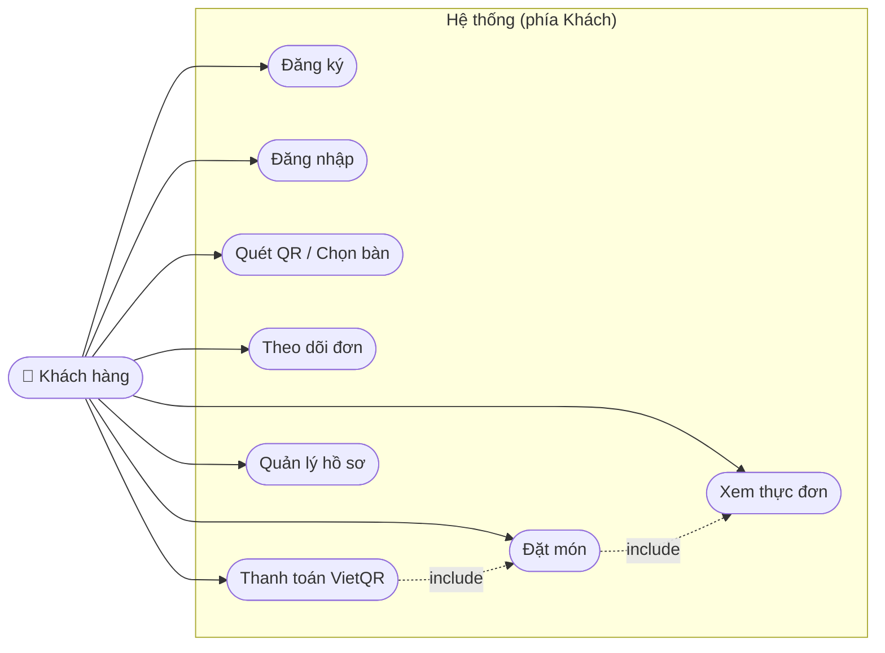

### 3.3.3. Sơ đồ Use case theo tác nhân Nhân viên

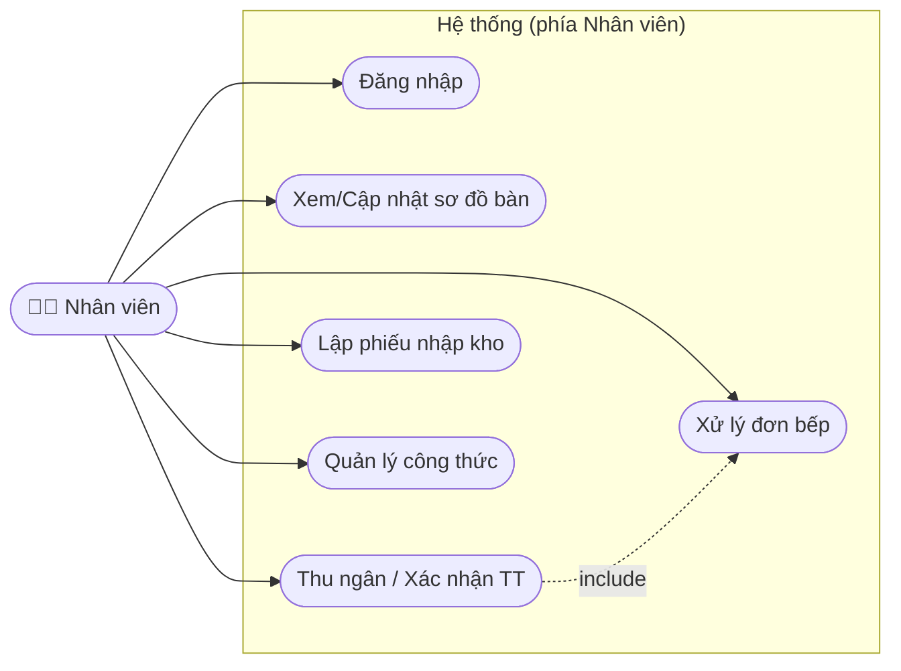

### 3.3.4. Sơ đồ Use case theo tác nhân Quản trị viên

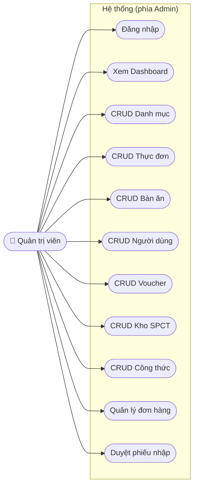

---

## 3.4. Đặc tả Use Case (Use Case Specification)

### Đặc tả UC-KH05 – Đặt món (tạo đơn hàng)

| Thuộc tính | Nội dung |
| :--- | :--- |
| **Mã / Tên UC** | UC-KH05 – Đặt món |
| **Tác nhân chính** | Khách hàng |
| **Mô tả** | Khách chọn món, số lượng, ghi chú, hình thức (ăn tại bàn / đến lấy / giao hàng), áp dụng voucher và tạo đơn hàng |
| **Tiền điều kiện** | Khách đã truy cập thực đơn (qua QR bàn `/menu?tableId=..` hoặc trực tiếp); hệ thống đang hoạt động |
| **Hậu điều kiện** | Đơn hàng được tạo với trạng thái `PENDING`; tổng tiền được tính; nếu ăn tại bàn → bàn chuyển `OCCUPIED` |
| **Luồng chính** | 1. Khách xem thực đơn & chọn món.<br>2. Khách điều chỉnh số lượng, ghi chú từng món.<br>3. Khách chọn hình thức đặt (DINE_IN / PICKUP / DELIVERY).<br>4. Nếu DELIVERY → nhập địa chỉ & SĐT; nếu PICKUP → nhập SĐT.<br>5. (Tùy chọn) Nhập mã voucher → hệ thống kiểm tra & tính giảm.<br>6. Khách xác nhận đặt món.<br>7. Hệ thống sinh `orderCode`, lưu đơn + chi tiết đơn (`order_items`, mỗi món `PENDING`), tính `total_amount`.<br>8. Hệ thống trả về mã đơn & thông tin thanh toán. |
| **Luồng thay thế** | **3a.** Chọn Ăn tại bàn → chọn bàn trống trên sơ đồ hoặc quét QR.<br>**5a.** Voucher không hợp lệ/hết hạn → thông báo lỗi, giữ nguyên đơn.<br>**7a.** Món vừa chuyển `UNAVAILABLE` (hết món) → thông báo & yêu cầu bỏ chọn. |
| **Nghiệp vụ liên quan** | Tính tổng tiền = Σ(slượng × giá) − giảm voucher; tồn kho chỉ trừ khi đơn hoàn tất (xem UC-NV03/UC-NV04) |

### Đặc tả UC-KH07 – Thanh toán VietQR

| Thuộc tính | Nội dung |
| :--- | :--- |
| **Mã / Tên UC** | UC-KH07 – Thanh toán VietQR |
| **Tác nhân chính** | Khách hàng |
| **Mô tả** | Sinh mã QR thanh toán động theo đúng mã đơn và số tiền cần trả |
| **Tiền điều kiện** | Đơn hàng tồn tại (`PENDING`/`PROCESSING`), chưa thanh toán |
| **Hậu điều kiện** | Mã VietQR được trả về để khách quét; khi nhân viên xác nhận → `Payment.status = COMPLETED` |
| **Luồng chính** | 1. Khách mở trang thanh toán của đơn.<br>2. Hệ thống lấy `total_amount`, `orderCode`.<br>3. Hệ thống sinh URL/ảnh VietQR động (ngân hàng – số TK – số tiền – nội dung = orderCode).<br>4. Khách quét & chuyển khoản; hệ thống/chờ nhân viên xác nhận. |
| **Luồng thay thế** | 2a. Đơn đã thanh toán → thông báo "Đã thanh toán". |

### Đặc tả UC-KH06 – Tra cứu đơn hàng

| Thuộc tính | Nội dung |
| :--- | :--- |
| **Mã / Tên UC** | UC-KH06 – Tra cứu đơn hàng |
| **Tác nhân chính** | Khách hàng |
| **Mô tả** | Xem trạng thái đơn theo thời gian thực (theo mã đơn, theo bàn, hoặc danh sách "đơn của tôi") |
| **Tiền điều kiện** | Có mã đơn hoặc đang ngồi tại bàn có mã QR |
| **Hậu điều kiện** | Hiển thị trạng thái đơn & từng món (`PENDING→PREPARING→READY→SERVED`) |
| **Luồng chính** | 1. Khách nhập mã đơn / mở link bàn / mở "Đơn của tôi".<br>2. Hệ thống truy vấn đơn + chi tiết.<br>3. Hiển thị trạng thái tổng và từng món. |

### Đặc tả UC-NV03 – Xử lý đơn bếp

| Thuộc vật | Nội dung |
| :--- | :--- |
| **Mã / Tên UC** | UC-NV03 – Xử lý đơn bếp |
| **Tác nhân chính** | Nhân viên (pha chế/bếp) |
| **Mô tả** | Chuyển trạng thái từng món và cả đơn theo luồng chế biến |
| **Tiền điều kiện** | Nhân viên đăng nhập; tồn tại đơn `PENDING/PROCESSING` |
| **Hậu điều kiện** | Món chuyển `PENDING→PREPARING→READY→SERVED`; đơn có thể chuyển `COMPLETED` |
| **Luồng chính** | 1. NV mở danh sách đơn.<br>2. NV chọn đơn → xem chi tiết món.<br>3. NV cập nhật trạng thái món (bắt đầu/pha chế xong).<br>4. Khi tất cả món `READY`/`SERVED` → cập nhật trạng thái đơn. |
| **Luồng thay thế** | 3a. Thiếu nguyên liệu (SPCT `OUT_OF_STOCK`) → báo cáo quản lý nhập thêm. |

### Đặc tả UC-NV04 – Thu ngân / Xác nhận thanh toán

| Thuộc tính | Nội dung |
| :--- | :--- |
| **Mã / Tên UC** | UC-NV04 – Thu ngân / Xác nhận thanh toán |
| **Tác nhân chính** | Nhân viên (thu ngân) |
| **Mô tả** | Xác nhận thanh toán đơn (tiền mặt / chuyển khoản / VNPAY), lập hóa đơn, giải phóng bàn |
| **Tiền điều kiện** | Đơn đã chế biến xong (`COMPLETED`), chưa thanh toán |
| **Hậu điều kiện** | Tạo `Payment` (status `COMPLETED`); đơn → `PAID`; bàn → `AVAILABLE`; **trừ kho nguyên liệu theo công thức TPSP** (nếu chưa trừ) |
| **Luồng chính** | 1. NV mở đơn cần thanh toán.<br>2. Hệ thống hiển thị tổng tiền, voucher đã áp dụng.<br>3. NV chọn phương thức thanh toán & xác nhận.<br>4. Hệ thống tạo bản ghi `Payment`, cập nhật đơn `PAID`.<br>5. Hệ thống đọc `TPSP` của từng món → trừ `stock_quantity` SPCT tương ứng.<br>6. Giải phóng bàn (`AVAILABLE`), in/tạo hóa đơn. |
| **Luồng thay thế** | 3a. Thanh toán VNPAY/Bank → NV kiểm tra giao dịch trước khi xác nhận.<br>5a. Tồn kho không đủ → ghi log cảnh báo, vẫn cho phép thanh toán (báo quản lý). |

### Đặc tả UC-AD01 – Quản lý thực đơn

| Thuộc tính | Nội dung |
| :--- | :--- |
| **Mã / Tên UC** | UC-AD01 – Quản lý thực đơn (CRUD) |
| **Tác nhân chính** | Quản trị viên |
| **Mô tả** | Thêm/sửa/xóa món ăn, cập nhật giá, hình ảnh, đổi trạng thái Còn món/Hết món |
| **Tiền điều kiện** | Đăng nhập với vai trò `ADMIN` |
| **Hậu điều kiện** | Dữ liệu `menu_items` được cập nhật |
| **Luồng chính** | 1. AD mở trang Thực đơn.<br>2. AD thêm/sửa món (tên, mô tả, giá, ảnh, danh mục).<br>3. AD lưu → hệ thống validate & ghi nhận.<br>4. (Tùy chọn) AD bật/tắt trạng thái (`AVAILABLE`↔`UNAVAILABLE`) hoặc xóa món. |

### Đặc tả UC-AD07 – Quản lý kho nguyên liệu (SPCT)

| Thuộc tính | Nội dung |
| :--- | :--- |
| **Mã / Tên UC** | UC-AD07 – Quản lý kho SPCT |
| **Tác nhân chính** | Quản trị viên (Nhân viên được xem/cập nhật tồn) |
| **Mô tả** | Quản lý quy cách/đơn vị/tồn kho/định mức tối thiểu; cảnh báo sắp hết hàng |
| **Tiền điều kiện** | Đăng nhập (`ADMIN`/`STAFF`) |
| **Hậu điều kiện** | `product_details` được cập nhật; cảnh báo khi `stock_quantity ≤ min_stock_alert` |
| **Luồng chính** | 1. Mở trang Kho.<br>2. Xem danh sách SPCT, lọc "sắp hết".<br>3. Thêm/sửa quy cách, đơn vị, giá vốn, ngưỡng cảnh báo.<br>4. Cập nhật nhanh tồn kho nếu cần. |
| **Nghiệp vụ** | Khi `stock_quantity ≤ 0` → status tự động `OUT_OF_STOCK` (xử lý trong `@PreUpdate`) |

### Đặc tả UC-AD08 – Nhập kho / Duyệt phiếu nhập (ĐNP)

| Thuộc tính | Nội dung |
| :--- | :--- |
| **Mã / Tên UC** | UC-AD08 – Nhập kho (ĐNP) |
| **Tác nhân chính** | Quản trị viên / Nhân viên |
| **Mô tả** | Lập phiếu nhập từ nhà cung cấp; duyệt nhập → tự động cộng tồn kho SPCT |
| **Tiền điều kiện** | Đăng nhập (`ADMIN`/`STAFF`); có SPCT để nhập |
| **Hậu điều kiện** | Phiếu `PENDING`→`COMPLETED`; `stock_quantity` của SPCT được **cộng thêm** số lượng nhập |
| **Luồng chính** | 1. Tạo phiếu nhập (mã, NCC, SĐT, địa chỉ).<br>2. Thêm dòng chi tiết: chọn SPCT, số lượng, đơn giá → thành tiền.<br>3. Lưu phiếu (`PENDING`).<br>4. Duyệt nhập (`complete`) → hệ thống duyệt từng dòng: `SPCT.stock += quantity`, cập nhật `cost_price`.<br>5. Phiếu → `COMPLETED`, cập nhật tổng tiền. |
| **Luồng thay thế** | 4a. Hủy phiếu (`cancel`) → không cộng tồn, phiếu `CANCELLED`. |

### Đặc tả UC-AD09 – Quản lý công thức (TPSP)

| Thuộc tính | Nội dung |
| :--- | :--- |
| **Mã / Tên UC** | UC-AD09 – Quản lý công thức (TPSP) |
| **Tác nhân chính** | Quản trị viên / Nhân viên |
| **Mô tả** | Thiết lập định lượng nguyên liệu cho mỗi món ăn (1 suất dùng bao nhiêu SPCT) |
| **Tiền điều kiện** | Đăng nhập; món ăn và SPCT tồn tại |
| **Hậu điều kiện** | `product_recipes` được cập nhật; hệ thống dùng để tự trừ kho khi bán |
| **Luồng chính** | 1. Chọn món ăn.<br>2. Thêm nguyên liệu (SPCT) + số lượng định mức + đơn vị.<br>3. Lưu công thức.<br>4. Sửa/xóa dòng công thức nếu cần. |

### Đặc tả UC-AD04 – Quản lý voucher

| Thuộc tính | Nội dung |
| :--- | :--- |
| **Mã / Tên UC** | UC-AD04 – Quản lý voucher |
| **Tác nhân chính** | Quản trị viên |
| **Mô tả** | Tạo mã giảm giá theo % hoặc số tiền cố định, đặt điều kiện & thời hạn |
| **Tiền điều kiện** | Đăng nhập `ADMIN` |
| **Hậu điều kiện** | `vouchers` được tạo/cập nhật |
| **Luồng chính** | 1. Tạo voucher: mã, loại giảm, giá trị.<br>2. Nếu PERCENTAGE → đặt mức giảm tối đa; nếu FIXED_AMOUNT → nhập số tiền.<br>3. Đặt đơn tối thiểu, thời hạn, giới hạn lượt dùng.<br>4. Lưu/kích hoạt voucher. |

### Đặc tả UC-AD06 – Quản lý người dùng & phân quyền

| Thuộc tính | Nội dung |
| :--- | :--- |
| **Mã / Tên UC** | UC-AD06 – Quản lý người dùng |
| **Tác nhân chính** | Quản trị viên |
| **Mô tả** | Quản lý tài khoản, phân quyền `ADMIN`/`STAFF`/`CUSTOMER`, bật/tắt trạng thái |
| **Tiền điều kiện** | Đăng nhập `ADMIN` |
| **Hậu điều kiện** | `users` được cập nhật (vai trò, trạng thái ACTIVE/INACTIVE) |
| **Luồng chính** | 1. Xem danh sách người dùng.<br>2. Thêm/sửa: họ tên, email, SĐT, vai trò.<br>3. Đặt lại mật khẩu / bật-khóa tài khoản.<br>4. Lưu. |

---

## 3.5. Sơ đồ thực thể – liên kết (ERD)

### 3.5.1. Sơ đồ ERD

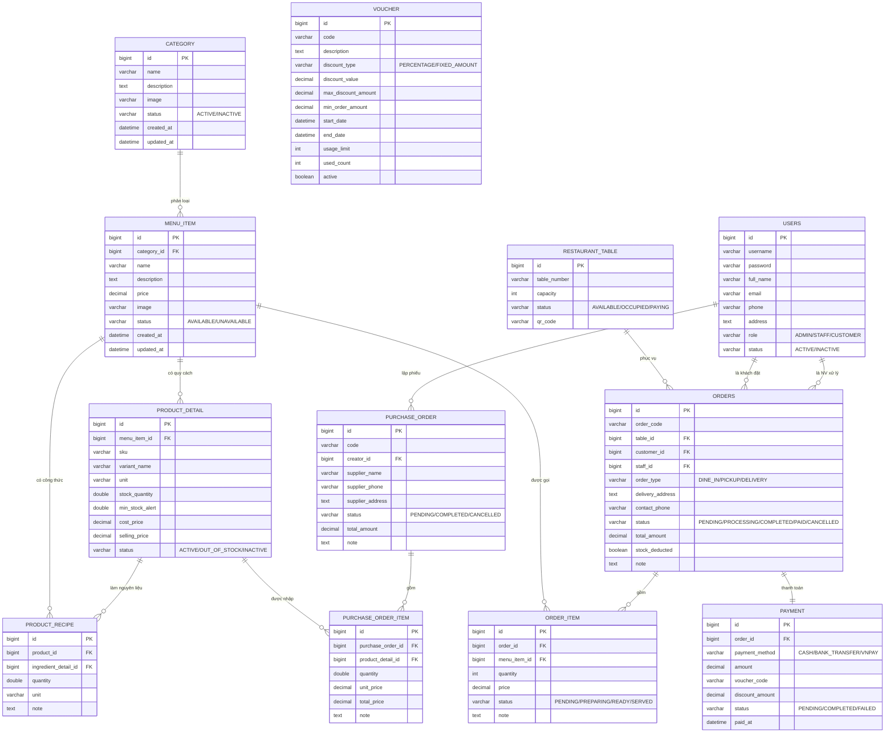

> **Ghi chú liên kết:** `VOUCHER` không liên kết khóa ngoại trực tiếp với `PAYMENT` mà liên kết *lỏng* qua trường `payment.voucher_code = voucher.code` (kiểu liên kết theo mã/logic), phù với nghiệp vụ "mỗi lần thanh toán có thể áp dụng 1 mã giảm giá".

### 3.5.2. Mô tả các thực thể và thuộc tính

| STT | Thực thể (Ký hiệu ERD) | Bảng | Thuộc tính chính | Mô tả nghiệp vụ |
| :--: | :--- | :--- | :--- | :--- |
| 1 | **TK** | `users` | id, username, password, fullName, email, phone, address, role, status | Tài khoản hệ thống, đóng 3 vai trò: ADMIN, STAFF, CUSTOMER |
| 2 | **Bàn** | `restaurant_tables` | id, tableNumber, capacity, status, qrCode | Bàn ăn, sức chứa, trạng thái (Trống/Có khách/Yêu cầu tính tiền), liên kết QR |
| 3 | **Loại món** | `categories` | id, name, description, image, status | Danh mục phân loại món ăn |
| 4 | **SP** | `menu_items` | id, categoryId, name, description, price, image, status | Món ăn/đồ uống trên thực đơn |
| 5 | **SPCT** | `product_details` | id, menuItemId, sku, variantName, unit, stockQuantity, minStockAlert, costPrice, sellingPrice, status | Quy cách/nguyên liệu kho: đơn vị, tồn kho, ngưỡng tối thiểu |
| 6 | **TPSP** | `product_recipes` | id, productId, ingredientDetailId, quantity, unit, note | Định lượng công thức: 1 suất món tiêu hao bao nhiêu nguyên liệu |
| 7 | **Đơn** | `orders` | id, orderCode, tableId, customerId, staffId, orderType, deliveryAddress, contactPhone, status, totalAmount, stockDeducted, note | Đơn hàng bán ra (gắn khách, bàn, nhân viên) |
| 8 | **CT ĐƠN** | `order_items` | id, orderId, menuItemId, quantity, price, status, note | Chi tiết món trong đơn |
| 9 | **ĐNP** | `purchase_orders` | id, code, creatorId, supplierName/Phone/Address, status, totalAmount, note | Phiếu nhập kho từ nhà cung cấp |
| 10 | **CT ĐN** | `purchase_order_items` | id, purchaseOrderId, productDetailId, quantity, unitPrice, totalPrice, note | Chi tiết nguyên liệu trong phiếu nhập |
| 11 | **Voucher** | `vouchers` | id, code, discountType, discountValue, maxDiscountAmount, minOrderAmount, startDate, endDate, usageLimit, usedCount, active | Mã giảm giá |
| 12 | **Thanh toán** | `payments` | id, orderId, paymentMethod, amount, voucherCode, discountAmount, status, paidAt | Giao dịch thanh toán cho đơn |

### 3.5.3. Mô tả các mối quan hệ

| Quan hệ | Thực thể | Bản số | Diễn giải |
| :--- | :--- | :--- | :--- |
| R1 | Loại món – SP | 1 – N | Một danh mục có nhiều món; món thuộc 1 danh mục |
| R2 | SP – SPCT | 1 – N | Một món có nhiều quy cách/biến thể kho |
| R3 | SP – TPSP | 1 – N | Một món có nhiều dòng công thức |
| R4 | SPCT – TPSP | 1 – N | Một nguyên liệu xuất hiện trong nhiều công thức |
| R5 | SPCT – CT ĐN | 1 – N | Một nguyên liệu được nhập qua nhiều phiếu |
| R6 | Bàn – Đơn | 1 – N | Một bàn có nhiều đơn theo thời gian |
| R7 | TK(khách) – Đơn | 1 – N | Một khách có nhiều đơn |
| R8 | TK(NV) – Đơn | 1 – N | Một nhân viên xử lý nhiều đơn |
| R9 | Đơn – CT ĐƠN | 1 – N | Một đơn gồm nhiều món |
| R10 | SP – CT ĐƠN | 1 – N | Một món xuất hiện trong nhiều chi tiết đơn |
| R11 | Đơn – Thanh toán | 1 – 1 | Mỗi đơn có đúng 1 giao dịch thanh toán |
| R12 | TK – ĐNP | 1 – N | Một nhân viên lập nhiều phiếu nhập |
| R13 | ĐNP – CT ĐN | 1 – N | Một phiếu gồm nhiều dòng nguyên liệu |
| R14 | Voucher – Thanh toán | 1 – N (lỏng) | Liên kết theo mã (không FK) |

---

## 3.6. Sơ đồ lớp phân tích (Class Diagram)

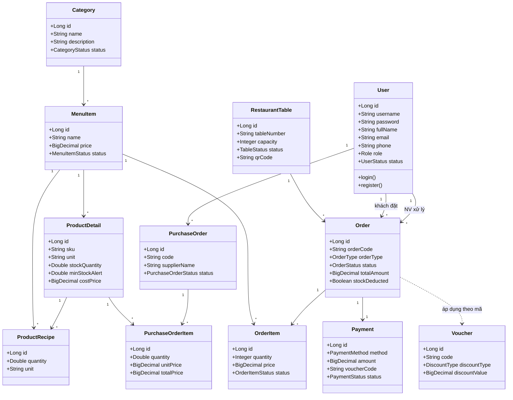

---

## 3.7. Sơ đồ hoạt động (Activity Diagram)

### 3.7.1. Hoạt động "Đặt món" (Khách hàng)

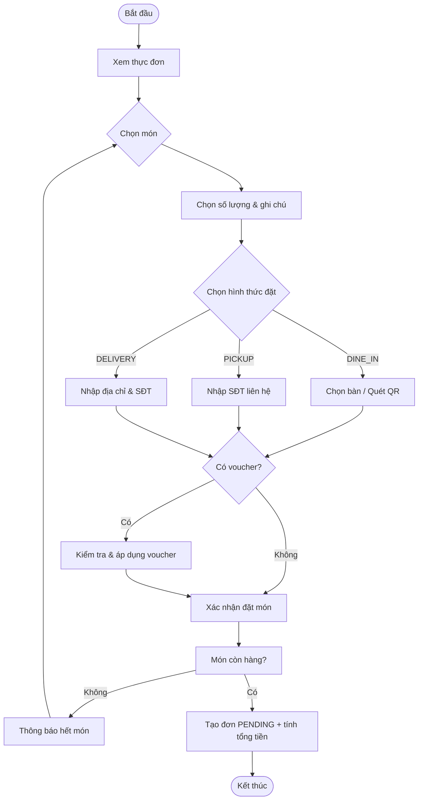

### 3.7.2. Hoạt động "Xử lý đơn bếp → Thu ngân" (Nhân viên)

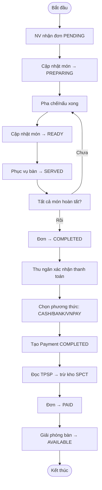

### 3.7.3. Hoạt động "Nhập kho & duyệt phiếu" (Admin/Nhân viên)

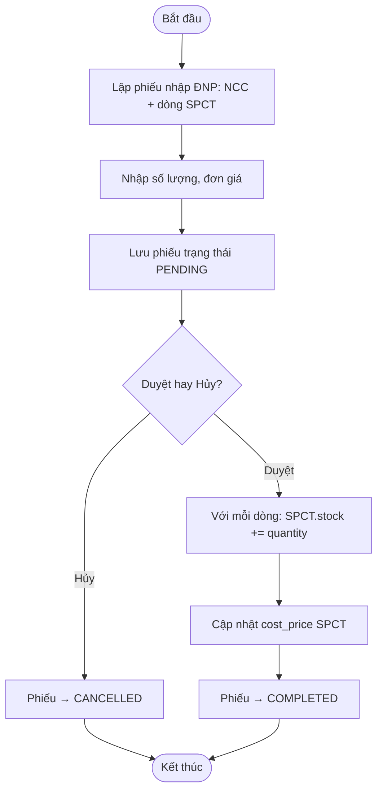

---

## 3.8. Sơ đồ tuần tự (Sequence Diagram)

### 3.8.1. Tuần tự "Đặt món"

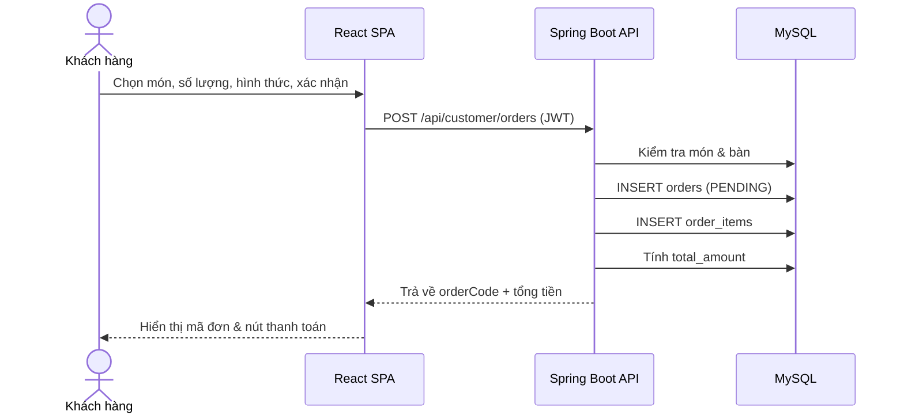

### 3.8.2. Tuần tự "Thanh toán VietQR & trừ kho"

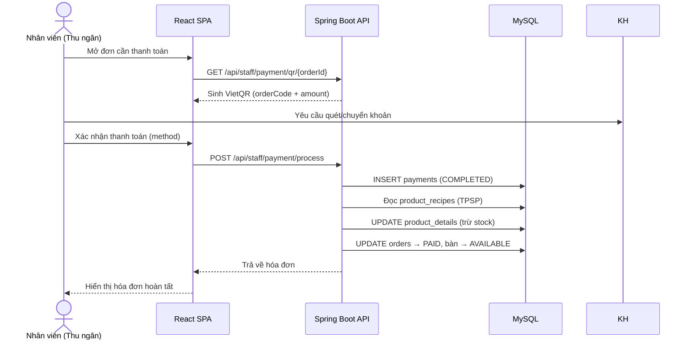

### 3.8.3. Tuần tự "Duyệt phiếu nhập kho"

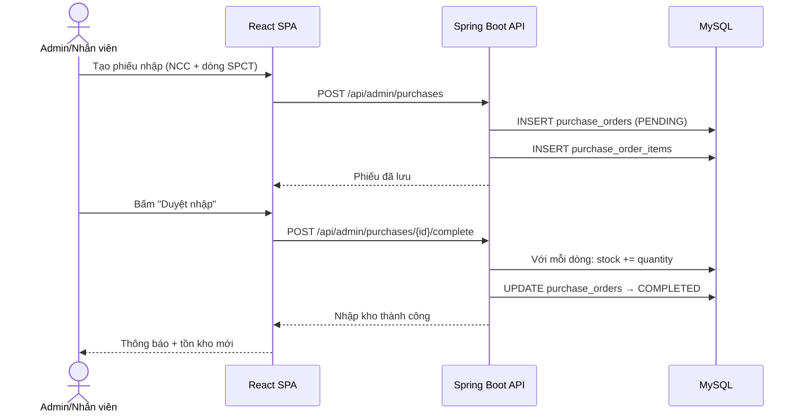

---

## 3.9. Luồng nghiệp vụ kho tự động (tổng kết)

```
[Nhập hàng]   Tạo ĐNP (PENDING) ──Duyệt──▶ stock SPCT (+ quantity)
[Bán hàng]    Đặt món (PENDING) ──Bếp xử lý──▶ Đọc TPSP ──Thanh toán──▶ stock SPCT (−)
```

| Giai đoạn | Sự kiện | Ảnh hưởng kho |
| :--- | :--- | :--- |
| Nhập | Duyệt phiếu nhập (`complete`) | **Cộng** tồn SPCT theo số lượng nhập |
| Bán | Xác nhận thanh toán (`processPayment`) | **Trừ** tồn SPCT theo định mức công thức TPSP |

---

*Hết Chương 3.*
