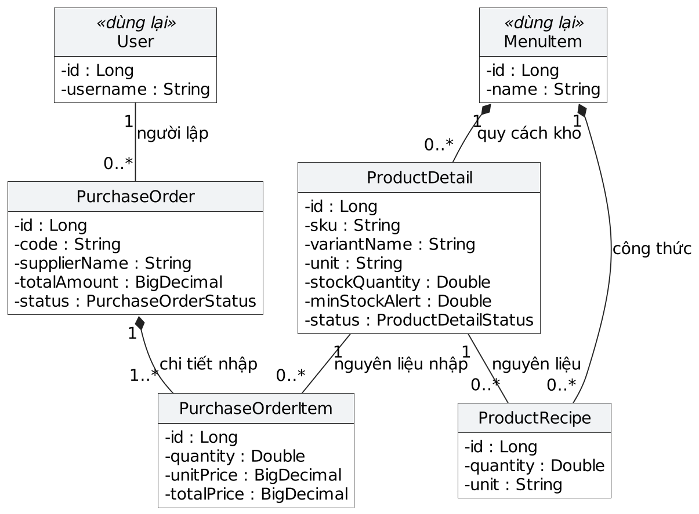

# CHƯƠNG 3. PHÂN TÍCH VÀ THIẾT KẾ HỆ THỐNG QUẢN LÝ NHÀ HÀNG

Chương này mô hình hóa chức năng và thiết kế của Restaurant Management System bằng UML. Phạm vi gồm đặt món, chế biến, thu ngân, quản trị thực đơn và quản lý kho. Hệ thống sử dụng React, Spring Boot và MySQL; các luồng dưới đây phản ánh nghiệp vụ trong mã nguồn hiện tại.

## 3.1. Tác nhân và phạm vi hệ thống

| Tác nhân | Phạm vi tương tác | Điều kiện truy cập |
| :--- | :--- | :--- |
| Khách hàng | Xem thực đơn, giỏ hàng, đặt món, tra cứu đơn, yêu cầu tính tiền và xem mã QR | Khách vãng lai được đặt món; hồ sơ và lịch sử cá nhân cần đăng nhập |
| Nhân viên | Xử lý đơn và món tại bếp, quản lý trạng thái bàn, thu ngân | Tài khoản có vai trò STAFF hoặc ADMIN |
| Quản trị viên | Quản lý danh mục, món, bàn, tài khoản, voucher, kho, công thức, phiếu nhập và báo cáo | Vai trò ADMIN; sử dụng được cả chức năng của Nhân viên |
| Dịch vụ VietQR | Cung cấp ảnh QR chuyển khoản cho trình duyệt | Hệ thống bên ngoài tại img.vietqr.io; không xác nhận tiền đã vào tài khoản |

Ranh giới hệ thống không bao gồm ứng dụng ngân hàng của khách hay việc nhân viên kiểm tra sao kê. Việc tạo mã QR và việc ghi nhận thanh toán là hai thao tác khác nhau. Các chức năng kho, công thức và phiếu nhập thuộc phân hệ quản trị theo quy tắc bảo vệ `/api/admin/**` trong `SecurityConfig`.

<!-- pagebreak -->

## 3.2. Biểu đồ ca sử dụng (Use Case Diagram)

### 3.2.1. Use Case tổng quát

Biểu đồ tổng quát gom các mục tiêu theo phân hệ. Tác nhân nằm ngoài biên hệ thống; liên kết với use case là đường liền không có mũi tên. Quan hệ khái quát hóa đi từ Quản trị viên đến Nhân viên, với tam giác rỗng ở phía tác nhân được kế thừa.

<!-- pagebreak -->

### 3.2.2. Phân hệ Khách hàng

Tìm kiếm hoặc lọc món là hành vi tùy chọn, nên `extend` hướng về “Xem thực đơn”. Đặt món hỗ trợ ăn tại bàn, đến lấy và giao hàng. Khách có thể chọn bàn trực tiếp hoặc quét QR; không bắt buộc quét QR. “Yêu cầu tính tiền” chỉ chuyển bàn sang `PAYING`, không bắt buộc xem QR hay đồng nghĩa với thanh toán thành công.

<!-- pagebreak -->

### 3.2.3. Phân hệ Nhân viên

“Thu ngân” bao gồm xem hóa đơn và ghi nhận thanh toán; mũi tên `include` đi từ use case cơ sở đến hành vi bắt buộc. Áp dụng voucher hoặc xem QR chỉ xảy ra khi có điều kiện tương ứng, nên `extend` đi từ hành vi mở rộng về “Thu ngân”. Đăng nhập là tiền điều kiện của nghiệp vụ, không phải một bước `include` lặp lại trong mọi use case.

<!-- pagebreak -->

### 3.2.4. Phân hệ Quản trị viên

Mỗi nhóm quản lý gồm các thao tác phù hợp như thêm, sửa, xóa hoặc đổi trạng thái. Khóa/mở tài khoản là thao tác của quản lý tài khoản, không tách thành quan hệ `extend` chỉ để liệt kê CRUD. Phiếu nhập được duyệt mới làm tăng tồn kho.

<!-- pagebreak -->

## 3.3. Đặc tả các Use Case chính

### 3.3.1. UC01 – Đăng nhập

| Thuộc tính | Nội dung |
| :--- | :--- |
| Tác nhân | Khách hàng, Nhân viên hoặc Quản trị viên |
| Mục tiêu | Xác thực tài khoản và truy cập đúng vai trò |
| Tiền điều kiện | Tài khoản đã được đăng ký hoặc được quản trị viên tạo |
| Hậu điều kiện | Thành công: trả JWT và thông tin vai trò; thất bại: không tạo phiên đăng nhập mới |
| Luồng chính | 1. Người dùng nhập tên đăng nhập, mật khẩu. 2. Giao diện gửi yêu cầu đăng nhập. 3. AuthenticationManager xác thực thông qua UserDetailsService, kiểm tra mật khẩu và trạng thái tài khoản. 4. Hệ thống sinh JWT, đọc thông tin tài khoản và trả AuthResponse. 5. Giao diện lưu token và điều hướng theo vai trò. |
| Luồng thay thế | 3a. Tài khoản không tồn tại hoặc sai mật khẩu: báo lỗi, cho phép nhập lại. 3b. Tài khoản INACTIVE: từ chối xác thực. |

<!-- pagebreak -->

### 3.3.2. UC02 – Đặt món

| Thuộc tính | Nội dung |
| :--- | :--- |
| Tác nhân | Khách hàng; không bắt buộc đăng nhập |
| Mục tiêu | Tạo đơn từ giỏ hàng theo hình thức đã chọn |
| Tiền điều kiện | Giỏ hàng có ít nhất một món; số lượng từng món lớn hơn 0 |
| Hậu điều kiện | Order và các OrderItem ở trạng thái PENDING; tổng tiền tính từ giá món trên máy chủ. Bàn đang AVAILABLE chuyển OCCUPIED đối với đơn ăn tại bàn. Khách đã đăng nhập được gắn đơn vào tài khoản. |
| Luồng chính | 1. Khách chọn món, số lượng và ghi chú. 2. Chọn DINE_IN, PICKUP hoặc DELIVERY. 3. DINE_IN: chọn bàn/quét QR; PICKUP: nhập SĐT; DELIVERY: nhập địa chỉ và SĐT. 4. Xác nhận đặt món. 5. Hệ thống kiểm tra bàn hoặc địa chỉ, kiểm tra từng món còn AVAILABLE. 6. Sinh orderCode; lưu đơn và chi tiết; tính tổng tiền, cập nhật bàn nếu cần trong cùng transaction. 7. Trả mã đơn để tra cứu tiến độ. |
| Luồng thay thế | 3a. Thiếu bàn, địa chỉ hoặc SĐT cần thiết: giao diện yêu cầu bổ sung. 5a. Bàn không tồn tại hoặc món ngừng bán: báo lỗi; rollback dữ liệu đã ghi tạm, giữ giỏ hàng. 6a. Lỗi lưu dữ liệu: rollback toàn bộ transaction, không để lại đơn một phần. |

Voucher không thuộc yêu cầu tạo đơn hiện tại: `OrderRequest` không có trường mã giảm giá. SĐT cho đơn đến lấy/giao hàng được kiểm tra tại giao diện; backend hiện kiểm tra bàn và địa chỉ theo hình thức đặt món.

<!-- pagebreak -->

### 3.3.3. UC03 – Thu ngân

| Thuộc tính | Nội dung |
| :--- | :--- |
| Tác nhân | Nhân viên hoặc Quản trị viên |
| Mục tiêu | Ghi nhận số tiền đã thu và trả hóa đơn |
| Tiền điều kiện | Đã đăng nhập đúng quyền; đơn tồn tại, chưa COMPLETED |
| Hậu điều kiện | Payment.status = COMPLETED, có paidAt; Order.status = COMPLETED. Bàn chuyển AVAILABLE chỉ nếu không còn đơn hoạt động trên bàn. |
| Luồng chính | 1. Nhân viên chọn đơn và xem hóa đơn. 2. Chọn phương thức; nhập voucher nếu có. 3. Nếu chuyển khoản, mở QR và đối chiếu sao kê; nếu tiền mặt, kiểm tra tiền đã thu. 4. Sau khi nhận/đối chiếu đủ tiền, gửi xác nhận thanh toán. 5. Máy chủ đọc đơn, kiểm tra trạng thái; xác thực voucher hoặc số tiền giảm và tính số tiền phải thu. 6. Lưu/cập nhật Payment, cập nhật Order, kiểm tra các đơn còn hoạt động trước khi giải phóng bàn. 7. Commit transaction và trả hóa đơn. |
| Luồng thay thế | 3a. Chưa nhận đủ tiền: chưa gửi xác nhận. 5a. Đơn đã COMPLETED: từ chối ghi nhận lại. 5b. Voucher không hợp lệ hoặc số tiền giảm vượt tổng tiền: báo lỗi, không ghi nhận thanh toán; sửa dữ liệu rồi gửi lại. 6a. Lỗi dữ liệu: rollback transaction; không trả kết quả thành công. |

Xác thực lại voucher khi xác nhận thanh toán là bắt buộc nếu request có mã; kết quả “kiểm tra voucher” trước đó chỉ là xem trước. Số tiền giảm bằng voucher được tính phía máy chủ, không lấy từ số tiền giảm do khách gửi.

<!-- pagebreak -->

## 3.4. Biểu đồ lớp (Class Diagram)

### 3.4.1. Các lớp đặt món và thanh toán

`Order` sở hữu `OrderItem` bằng composition. Mỗi đơn có `0..1` Payment; khách, nhân viên và bàn đều có thể vắng mặt (`0..1`). `Payment.voucherCode` chỉ lưu chuỗi mã, không phải khóa ngoại tới `Voucher`.

<!-- pagebreak -->

### 3.4.2. Các lớp quản lý kho và nhập hàng

`User` và `MenuItem` dùng lại từ Hình 3.5, không phải các lớp mới. `ProductDetail` lưu quy cách/tồn kho và được tham chiếu làm nguyên liệu qua `ProductRecipe`. Phiếu nhập sở hữu các dòng `PurchaseOrderItem`. Hai biểu đồ bao phủ 12 lớp thực thể; bỏ getter/setter, timestamp và thuộc tính mô tả ít ảnh hưởng tới quan hệ. Phép tính tổng tiền, kiểm tra voucher và xử lý thanh toán thuộc Service, không gán các phương thức không tồn tại cho Entity.

<!-- landscape -->

## 3.5. Biểu đồ tuần tự (Sequence Diagram)

### 3.5.1. UC01 – Đăng nhập

`AuthenticationManager` sử dụng `UserDetailsService`/JPA để tìm tài khoản và kiểm tra mật khẩu, trạng thái. Chỉ nhánh xác thực thành công mới gọi `JwtTokenProvider`. Khung `alt` chứa riêng luồng lỗi và luồng thành công; đường liền là lời gọi, nét đứt là phản hồi, thanh hẹp trên lifeline biểu diễn thời gian thực thi.

<!-- pagebreak -->

### 3.5.2. UC02 – Đặt món

Repository/Hibernate được rút gọn thành thông điệp JPA. Nhánh lỗi rollback; nhánh hợp lệ trả `201 Created`. Khách vãng lai có `customerId = null` vẫn đặt được. Các thao tác lưu tạm cùng transaction, không tạo đơn một phần.

<!-- pagebreak -->

### 3.5.3. UC03 – Ghi nhận thanh toán

Biểu đồ minh họa luồng thành công sau khi đã nhận/đối chiếu tiền. Khung `opt` chỉ thực hiện khi có voucher hoặc có bàn. Lỗi voucher/dữ liệu xử lý theo luồng thay thế UC03 và rollback transaction. `processStaffPayment` đặt đơn thành `COMPLETED`; không sinh QR, gọi ngân hàng hay trừ kho trong phương thức này.

<!-- portrait -->

## 3.6. Biểu đồ hoạt động (Activity Diagram)

### 3.6.1. UC02 – Luồng đặt món

Hai làn phân định trách nhiệm của Khách hàng và Hệ thống. Luồng lỗi quay về sửa yêu cầu, giữ giỏ hàng. Khi hợp lệ, hệ thống lưu đơn/chi tiết trong transaction, cập nhật bàn nếu cần rồi trả mã đơn.

<!-- pagebreak -->

### 3.6.2. UC03 – Luồng thu ngân

Nhân viên chỉ gửi xác nhận sau khi nhận đủ tiền. Điều kiện hợp lệ dẫn tới lưu Payment, hoàn tất đơn và kiểm tra bàn; điều kiện lỗi dẫn tới rollback, kết thúc lần xác nhận không thành công.

<!-- pagebreak -->

## 3.7. Thiết kế kiến trúc

### 3.7.1. Biểu đồ thành phần (Component Diagram)

React sử dụng giao diện REST do backend cung cấp. API gọi Service; Service sử dụng tầng Spring Data JPA để truy cập MySQL. Backend chỉ tạo URL QR, còn trình duyệt tải ảnh trực tiếp từ VietQR qua HTTPS. Các hộp thành phần thể hiện phụ thuộc phần mềm; không dùng chúng thay cho biểu đồ lớp.

<!-- pagebreak -->

### 3.7.2. Biểu đồ triển khai (Deployment Diagram)

Nút thiết bị/môi trường thực thi chứa các artifact được triển khai. Trình duyệt tải SPA từ Nginx và gửi `/api` qua reverse proxy tới Spring Boot. Backend kết nối MySQL qua TCP 3306 nội bộ; `mysql_data` gắn tại `/var/lib/mysql`. Docker Compose hiện dùng HTTP ở Nginx, chưa cấu hình TLS; kênh tải ảnh VietQR là HTTPS. Cổng 3307 chỉ là ánh xạ MySQL ra máy chủ.

<!-- pagebreak -->

## 3.8. Các điểm cần phân biệt trong triển khai

- **Trạng thái đơn:** enum có `PAID`, nhưng `processStaffPayment` đang ghi `COMPLETED`. Báo cáo mô tả giá trị thực tế, không tự thêm bước đổi sang `PAID`.
- **Thời điểm trừ kho:** `OrderServiceImpl.updateOrderStatus` gọi trừ kho khi chuyển đơn sang `PROCESSING` hoặc `COMPLETED` và chưa `stockDeducted`. Chỉ đổi trạng thái từng món không gọi hàm trừ kho; `PaymentServiceImpl` cũng không gọi hàm này. Duyệt phiếu nhập trong `completePurchaseOrder` mới cộng tồn.
- **QR và voucher:** URL QR hiện lấy `Order.totalAmount`, không trừ voucher như số tiền trong Payment. Nhân viên cần đối chiếu số tiền thực nhận; không coi ảnh QR là kết quả thanh toán đã xác nhận.
- **Thanh toán trực tuyến:** không có webhook xác nhận ngân hàng; `VNPAY` hiện là lựa chọn/giá trị phương thức ghi nhận, chưa phải một luồng tích hợp cổng thanh toán.

Các giới hạn này là đặc điểm của mã nguồn hiện tại, không phải chức năng đã hoàn thiện hay thay đổi được thực hiện trong chương thiết kế.
