# PHÂN TÍCH VÀ THIẾT KẾ HỆ THỐNG QUẢN LÝ NHÀ HÀNG

> **Đề tài:** Restaurant Management System · **Công nghệ:** Java 17, Spring Boot 3.3 (Security + JWT, Spring Data JPA), MySQL 8.0, React 18 + Vite.
> **Phương pháp:** Mô hình hóa UML, kiến trúc Client–Server/REST, kiến trúc phân tầng (Controller – Service – Repository – Entity).
> Các sơ đồ dưới đây (Hình 2.1 – 2.13) được sinh tự động cho hệ thống và bám sát mã nguồn thực tế.

---

## 1. Xác định tác nhân (Actors)

| Ký hiệu | Tác nhân | Mô tả | Quyền truy cập chính |
| :---: | :--- | :--- | :--- |
| KH | **Khách hàng** (Customer) | Người dùng cuối đặt món (ăn tại bàn / đến lấy / giao hàng) | Xem thực đơn, giỏ hàng, đặt món, thanh toán VietQR, tra cứu đơn, hồ sơ |
| NV | **Nhân viên** (Staff) | Phục vụ, pha chế/bếp, thu ngân | Sơ đồ bàn, xử lý đơn bếp, thu ngân, nhập kho |
| AD | **Quản trị viên** (Admin) | Người quản trị hệ thống | Toàn quyền: dashboard, CRUD toàn bộ danh mục, thực đơn, bàn, người dùng, voucher, kho, nhập hàng, công thức |
| — | Hệ thống ngân hàng (VietQR) | Dịch vụ bên ngoài sinh mã QR chuyển khoản | Sinh mã QR thanh toán động |

> Admin thừa hưởng toàn bộ quyền của Nhân viên; Khách hàng độc lập. Tác nhân "Hệ thống ngân hàng" là hệ thống ngoài (external), chỉ tương tác khi thanh toán chuyển khoản.

---

## 2. Sơ đồ Use Case (Use Case Diagram)

### 2.1. Biểu đồ usecase tổng quát

**Hình 2.1 – Biểu đồ usecase tổng quát của hệ thống**

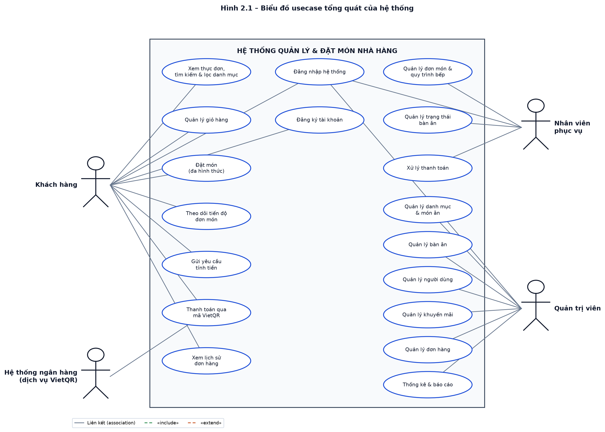

**Mô tả Hình 2.1:** Hệ thống gồm 4 tác nhân: Khách hàng, Nhân viên phục vụ, Quản trị viên và Hệ thống ngân hàng (VietQR). Khách hàng xem thực đơn, quản lý giỏ hàng, đặt món (đa hình thức), theo dõi tiến độ, gửi yêu cầu tính tiền, thanh toán qua VietQR và xem lịch sử đơn. Nhân viên quản lý đơn món & quy trình bếp, trạng thái bàn ăn và xử lý thanh toán. Quản trị viên quản lý danh mục & món ăn, bàn ăn, người dùng, khuyến mãi, đơn hàng và xem thống kê – báo cáo. Hai use case "Đăng nhập"/"Đăng ký" dùng chung cho nhiều tác nhân.

### 2.2. Biểu đồ usecase phân hệ Khách hàng

**Hình 2.2 – Biểu đồ usecase phân hệ Khách hàng**

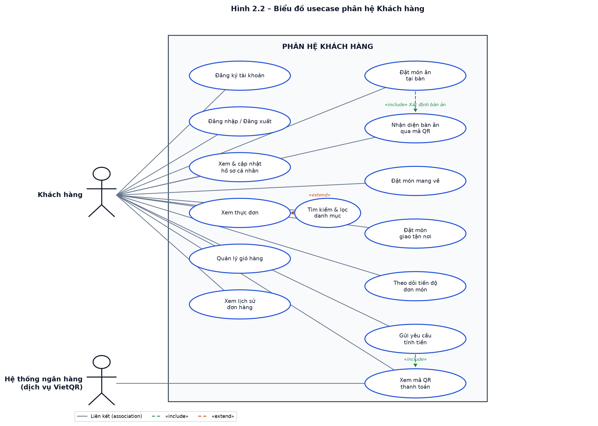

**Mô tả Hình 2.2:** Khách hàng có thể đăng ký/đăng nhập, cập nhật hồ sơ, xem thực đơn (có «extend» tìm kiếm & lọc danh mục), quản lý giỏ hàng, xem lịch sử đơn. Nhóm đặt món gồm: đặt ăn tại bàn («include» nhận diện bàn qua mã QR), đặt mang về, đặt giao tận nơi, theo dõi tiến độ, gửi yêu cầu tính tiền («include» xem mã QR thanh toán). Dịch vụ VietQR tham gia khi khách xem mã QR thanh toán.

### 2.3. Biểu đồ usecase phân hệ Nhân viên phục vụ

**Hình 2.3 – Biểu đồ usecase phân hệ Nhân viên phục vụ**

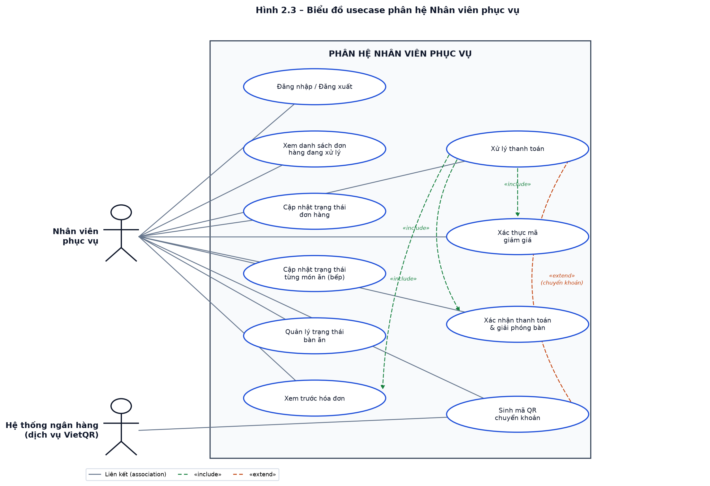

**Mô tả Hình 2.3:** Nhân viên đăng nhập, xem danh sách đơn đang xử lý, cập nhật trạng thái đơn và trạng thái từng món (bếp), quản lý trạng thái bàn ăn, xem trước hóa đơn. Nhóm thanh toán: "Xử lý thanh toán" «include» "Xác thực mã giảm giá", "Xác nhận thanh toán & giải phóng bàn", "Xem trước hóa đơn"; "Sinh mã QR chuyển khoản" «extend» khi khách chọn chuyển khoản (qua dịch vụ VietQR).

### 2.4. Biểu đồ usecase phân hệ Quản trị viên

**Hình 2.4 – Biểu đồ usecase phân hệ Quản trị viên**

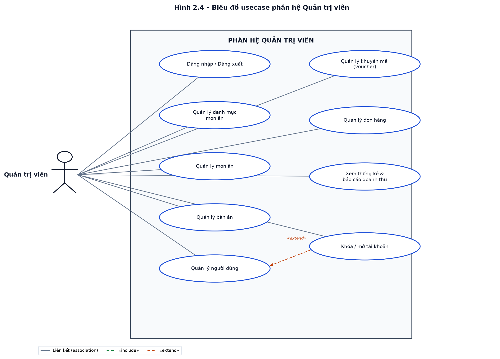

**Mô tả Hình 2.4:** Quản trị viên đăng nhập, quản lý danh mục món ăn, món ăn, bàn ăn, người dùng, khuyến mãi (voucher), đơn hàng và xem thống kê – báo cáo doanh thu. Use case "Khóa/mở tài khoản" «extend» từ "Quản lý người dùng".

---

## 3. Đặc tả Use Case (Use Case Specification)

### Đặc tả UC-KH – Đặt món (tạo đơn hàng)

| Thuộc tính | Nội dung |
| :--- | :--- |
| **Tên UC** | Đặt món (tạo đơn hàng) |
| **Tác nhân** | Khách hàng |
| **Mô tả** | Chọn món, số lượng, ghi chú, hình thức (ăn tại bàn / đến lấy / giao hàng), áp dụng voucher và tạo đơn |
| **Tiền điều kiện** | Đã truy cập thực đơn (qua QR bàn `/menu?tableId=..` hoặc trực tiếp) |
| **Hậu điều kiện** | Đơn tạo ở trạng thái `PENDING`, tính `total_amount`; đơn ăn tại bàn → bàn chuyển `OCCUPIED` |
| **Luồng chính** | 1. Xem thực đơn, chọn món.<br>2. Điều chỉnh số lượng, ghi chú.<br>3. Chọn hình thức đặt.<br>4. Nếu DELIVERY → nhập địa chỉ & SĐT; PICKUP → nhập SĐT.<br>5. (Tùy chọn) Nhập voucher → hệ thống kiểm tra & tính giảm.<br>6. Xác nhận đặt món.<br>7. Hệ thống sinh `orderCode`, lưu `orders` + `order_items` (mỗi món `PENDING`), tính tổng tiền.<br>8. Trả về mã đơn & thông tin thanh toán. |
| **Luồng thay thế** | **3a.** Ăn tại bàn → chọn bàn trống/quét QR. **5a.** Voucher không hợp lệ/hết hạn → báo lỗi, giữ nguyên đơn. **7a.** Món vừa `UNAVAILABLE` → thông báo, yêu cầu bỏ chọn. |

### Đặc tả UC-KH – Thanh toán VietQR

| Thuộc tính | Nội dung |
| :--- | :--- |
| **Tên UC** | Thanh toán VietQR |
| **Tác nhân** | Khách hàng |
| **Mô tả** | Sinh mã QR thanh toán động theo đúng mã đơn và số tiền |
| **Tiền điều kiện** | Đơn tồn tại (`PENDING`/`PROCESSING`), chưa thanh toán |
| **Hậu điều kiện** | Trả về mã VietQR; khi nhân viên xác nhận → `Payment.status = COMPLETED` |
| **Luồng chính** | 1. Mở trang thanh toán của đơn. 2. Hệ thống lấy `total_amount`, `orderCode`. 3. Sinh URL/ảnh VietQR động (ngân hàng – số TK – số tiền – nội dung = orderCode). 4. Khách quét & chuyển khoản; chờ nhân viên xác nhận. |
| **Luồng thay thế** | **2a.** Đơn đã thanh toán → thông báo "Đã thanh toán". |

### Đặc tả UC-KH – Tra cứu đơn hàng

| Thuộc tính | Nội dung |
| :--- | :--- |
| **Tên UC** | Tra cứu đơn hàng |
| **Tác nhân** | Khách hàng |
| **Mô tả** | Xem trạng thái đơn theo thời gian thực (theo mã đơn, theo bàn, hoặc "đơn của tôi") |
| **Luồng chính** | 1. Nhập mã đơn / mở link bàn / mở "Đơn của tôi". 2. Hệ thống truy vấn đơn + chi tiết. 3. Hiển thị trạng thái tổng và từng món (`PENDING→PREPARING→READY→SERVED`). |

### Đặc tả UC-NV – Xử lý đơn bếp

| Thuộc tính | Nội dung |
| :--- | :--- |
| **Tên UC** | Xử lý đơn bếp |
| **Tác nhân** | Nhân viên (pha chế/bếp) |
| **Mô tả** | Chuyển trạng thái từng món và cả đơn theo luồng chế biến |
| **Hậu điều kiện** | Món chuyển `PENDING→PREPARING→READY→SERVED`; đơn có thể chuyển `COMPLETED` |
| **Luồng chính** | 1. Mở danh sách đơn. 2. Chọn đơn → xem chi tiết món. 3. Cập nhật trạng thái món. 4. Khi tất cả món `READY`/`SERVED` → cập nhật trạng thái đơn. |
| **Luồng thay thế** | **3a.** Thiếu nguyên liệu (SPCT `OUT_OF_STOCK`) → báo cáo quản lý nhập thêm. |

### Đặc tả UC-NV – Thu ngân / Xác nhận thanh toán

| Thuộc tính | Nội dung |
| :--- | :--- |
| **Tên UC** | Thu ngân / Xác nhận thanh toán |
| **Tác nhân** | Nhân viên (thu ngân) |
| **Mô tả** | Xác nhận thanh toán (tiền mặt / chuyển khoản / VNPAY), lập hóa đơn, giải phóng bàn, trừ kho |
| **Tiền điều kiện** | Đơn đã chế biến xong (`COMPLETED`), chưa thanh toán |
| **Hậu điều kiện** | Tạo `Payment` (`COMPLETED`); đơn → `PAID`; bàn → `AVAILABLE`; **trừ kho SPCT theo công thức TPSP** (nếu chưa trừ) |
| **Luồng chính** | 1. Mở đơn cần thanh toán. 2. Hiển thị tổng tiền, voucher. 3. Chọn phương thức & xác nhận. 4. Tạo `Payment`, cập nhật đơn `PAID`. 5. Đọc `TPSP` từng món → trừ `stock_quantity` SPCT. 6. Giải phóng bàn, tạo hóa đơn. |
| **Luồng thay thế** | **3a.** VNPAY/Bank → kiểm tra giao dịch trước khi xác nhận. **5a.** Tồn kho không đủ → ghi log cảnh báo, vẫn cho thanh toán. |

### Đặc tả UC-AD – Quản lý thực đơn / Danh mục / Bàn / Người dùng / Voucher / Kho / Công thức / Nhập kho

| Nhóm UC | Mô tả | Hậu điều kiện nổi bật |
| :--- | :--- | :--- |
| Quản lý thực đơn | Thêm/sửa/xóa món, giá, ảnh, đổi `AVAILABLE`↔`UNAVAILABLE` | `menu_items` cập nhật |
| Quản lý danh mục | CRUD danh mục món ăn | `categories` cập nhật |
| Quản lý bàn ăn | Thêm bàn, số ghế, xuất link & mã QR | `restaurant_tables` cập nhật |
| Quản lý người dùng | Quản lý tài khoản, phân quyền `ADMIN/STAFF/CUSTOMER`, bật-khóa | `users` cập nhật |
| Quản lý voucher | Tạo mã giảm giá % / số tiền, điều kiện & thời hạn | `vouchers` cập nhật |
| Quản lý kho (SPCT) | Quy cách, đơn vị, tồn kho, ngưỡng tối thiểu; cảnh báo sắp hết | `product_details` cập nhật; `stock≤0` → `OUT_OF_STOCK` |
| Quản lý công thức (TPSP) | Định lượng nguyên liệu cho từng món | `product_recipes` cập nhật |
| Nhập kho / Duyệt phiếu (ĐNP) | Lập phiếu nhập; **duyệt → cộng tồn** SPCT | `PENDING→COMPLETED`; `stock += quantity` |

---

## 4. Thiết kế cơ sở dữ liệu (Thực thể – Liên kết)

Hệ thống gồm **12 thực thể** nghiệp vụ, ánh xạ 1-1 với 12 bảng MySQL qua Spring Data JPA/Hibernate.

### 4.1. Mô tả các thực thể và thuộc tính

| STT | Ký hiệu ERD | Bảng | Thuộc tính chính | Mô tả |
| :--: | :--- | :--- | :--- | :--- |
| 1 | **TK** | `users` | id, username, password, fullName, email, phone, address, role, status | Tài khoản (ADMIN/STAFF/CUSTOMER) |
| 2 | **Bàn** | `restaurant_tables` | id, tableNumber, capacity, status, qrCode | Bàn ăn, trạng thái `AVAILABLE/OCCUPIED/PAYING` |
| 3 | **Loại món** | `categories` | id, name, description, image, status | Danh mục phân loại món |
| 4 | **SP** | `menu_items` | id, categoryId, name, description, price, image, status | Món ăn/đồ uống |
| 5 | **SPCT** | `product_details` | id, menuItemId, sku, variantName, unit, stockQuantity, minStockAlert, costPrice, sellingPrice, status | Nguyên liệu/quy cách kho |
| 6 | **TPSP** | `product_recipes` | id, productId, ingredientDetailId, quantity, unit, note | Định lượng công thức món ăn |
| 7 | **Đơn** | `orders` | id, orderCode, tableId, customerId, staffId, orderType, deliveryAddress, contactPhone, status, totalAmount, stockDeducted, note | Đơn hàng bán ra |
| 8 | **CT ĐƠN** | `order_items` | id, orderId, menuItemId, quantity, price, status, note | Chi tiết món trong đơn |
| 9 | **ĐNP** | `purchase_orders` | id, code, creatorId, supplierName/Phone/Address, status, totalAmount, note | Phiếu nhập kho |
| 10 | **CT ĐN** | `purchase_order_items` | id, purchaseOrderId, productDetailId, quantity, unitPrice, totalPrice, note | Chi tiết nguyên liệu nhập |
| 11 | **Voucher** | `vouchers` | id, code, discountType, discountValue, maxDiscountAmount, minOrderAmount, startDate, endDate, usageLimit, usedCount, active | Mã giảm giá |
| 12 | **Thanh toán** | `payments` | id, orderId, paymentMethod, amount, voucherCode, discountAmount, status, paidAt | Giao dịch thanh toán |

### 4.2. Mô tả các mối quan hệ

| Quan hệ | Thực thể | Bản số | Diễn giải |
| :--- | :--- | :--- | :--- |
| R1 | Loại món – SP | 1 – N | Một danh mục có nhiều món |
| R2 | SP – SPCT | 1 – N | Một món có nhiều quy cách/biến thể kho |
| R3 | SP – TPSP | 1 – N | Một món có nhiều dòng công thức |
| R4 | SPCT – TPSP | 1 – N | Một nguyên liệu xuất hiện trong nhiều công thức |
| R5 | SPCT – CT ĐN | 1 – N | Một nguyên liệu được nhập qua nhiều phiếu |
| R6 | Bàn – Đơn | 1 – N | Một bàn có nhiều đơn theo thời gian |
| R7 | TK(khách) – Đơn | 1 – N | Một khách có nhiều đơn |
| R8 | TK(NV) – Đơn | 1 – N | Một nhân viên xử lý nhiều đơn |
| R9 | Đơn – CT ĐƠN | 1 – N | Một đơn gồm nhiều món |
| R10 | SP – CT ĐƠN | 1 – N | Một món xuất hiện trong nhiều chi tiết đơn |
| R11 | Đơn – Thanh toán | 1 – 1 | Mỗi đơn có đúng 1 giao dịch thanh toán |
| R12 | TK – ĐNP | 1 – N | Một nhân viên lập nhiều phiếu nhập |
| R13 | ĐNP – CT ĐN | 1 – N | Một phiếu gồm nhiều dòng nguyên liệu |
| R14 | Voucher – Thanh toán | 1 – N (lỏng) | Liên kết theo mã: `payment.voucher_code = voucher.code` (không dùng khóa ngoại) |

---

## 5. Biểu đồ lớp (Class Diagram)

### 5.1. Biểu đồ lớp tổng quan theo kiến trúc phân tầng

**Hình 2.5 – Biểu đồ lớp tổng quan theo kiến trúc phân tầng**

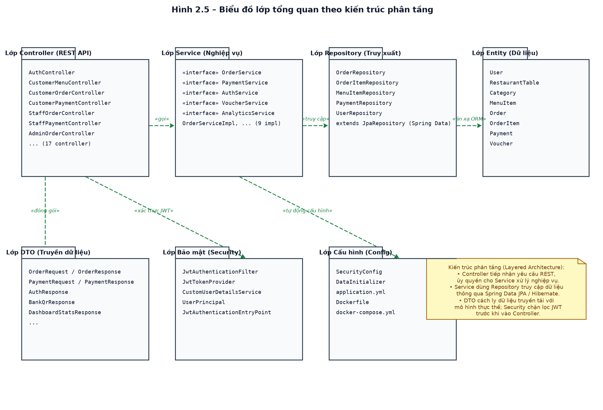

**Mô tả Hình 2.5:** Hệ thống tổ chức theo kiến trúc phân tầng: **Controller** (17 REST Controller) → **Service** (9 cặp interface/impl) → **Repository** (8 interface kế thừa `JpaRepository`) → **Entity** (12 thực thể ánh xạ 12 bảng). Bổ trợ: **DTO** (cách ly dữ liệu truyền tải), **Security** (JwtAuthenticationFilter, JwtTokenProvider), **Config** (SecurityConfig, DataInitializer). Controller gọi Service, Service truy cập Repository, Repository ánh xạ ORM xuống Entity; Security lọc JWT trước khi vào Controller.

### 5.2. Biểu đồ lớp chi tiết mô hình nghiệp vụ (domain model)

**Hình 2.6 – Biểu đồ lớp chi tiết mô hình nghiệp vụ**

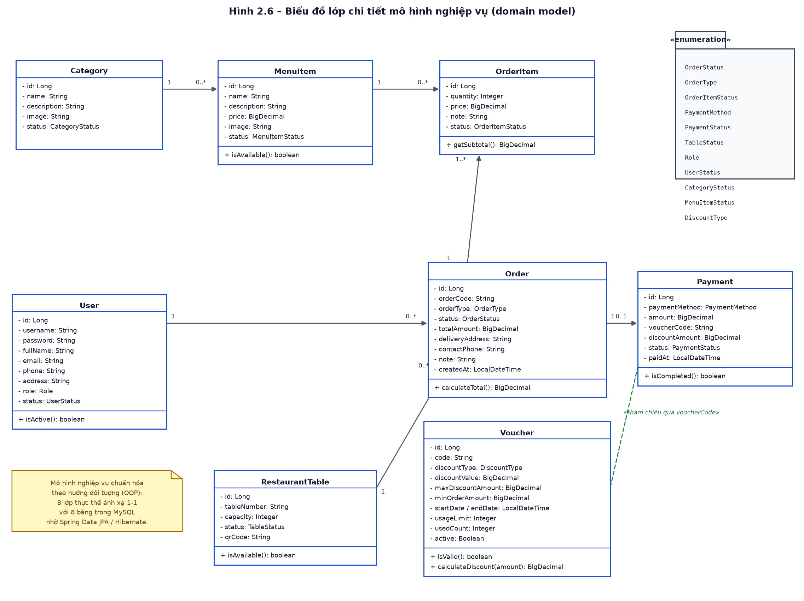

**Mô tả Hình 2.6:** Các lớp thực thể cốt lõi và quan hệ: `Category` 1–0..* `MenuItem`; `MenuItem` 1–0..* `OrderItem`; `Order` 1–1..* `OrderItem`; `User` 1–0..* `Order`; `RestaurantTable` 1–0..* `Order`; `Order` 1–0..1 `Payment`; `Voucher` tham chiếu gián tiếp qua `voucherCode`. Các lớp còn lại (`ProductDetail`, `ProductRecipe`, `PurchaseOrder`, `PurchaseOrderItem`) mở rộng mô hình kho (xem mục 4).

---

## 6. Biểu đồ tuần tự (Sequence Diagram)

### 6.1. Đăng nhập hệ thống

**Hình 2.7 – Biểu đồ tuần tự: Đăng nhập hệ thống**

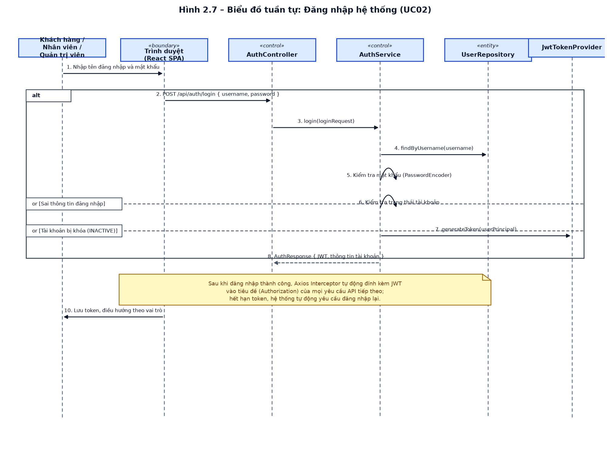

**Mô tả Hình 2.7:** Người dùng nhập thông tin trên React → `POST /api/auth/login` → AuthController ủy quyền AuthService: tìm tài khoản qua UserRepository, đối chiếu mật khẩu (PasswordEncoder), kiểm tra trạng thái, sinh JWT qua JwtTokenProvider. Phản hồi `AuthResponse` (JWT + thông tin) → trình duyệt lưu token, điều hướng theo vai trò. Luồng thay thế: sai thông tin (lỗi 401), tài khoản bị khóa (`INACTIVE`). Sau đó Axios Interceptor tự đính kèm JWT vào mọi request.

### 6.2. Đặt món của Khách hàng

**Hình 2.8 – Biểu đồ tuần tự: Đặt món của Khách hàng**

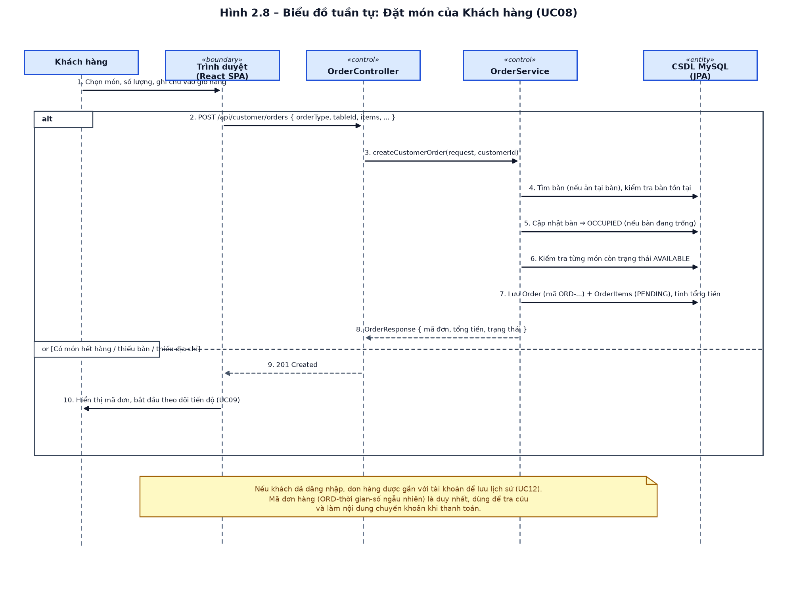

**Mô tả Hình 2.8:** Khách chọn món vào giỏ → `POST /api/customer/orders` → OrderController gọi OrderService: kiểm tra bàn (ăn tại bàn → chuyển `OCCUPIED`), kiểm tra từng món `AVAILABLE`, sinh mã đơn (`ORD-...`), lưu `Order` + `OrderItems` (`PENDING`), tính tổng tiền. Trả `OrderResponse` (mã đơn, tổng tiền) để khách theo dõi tiến độ. Luồng thay thế: món hết hàng/thiếu bàn/địa chỉ → báo lỗi, giữ giỏ hàng.

### 6.3. Xử lý thanh toán

**Hình 2.9 – Biểu đồ tuần tự: Xử lý thanh toán**

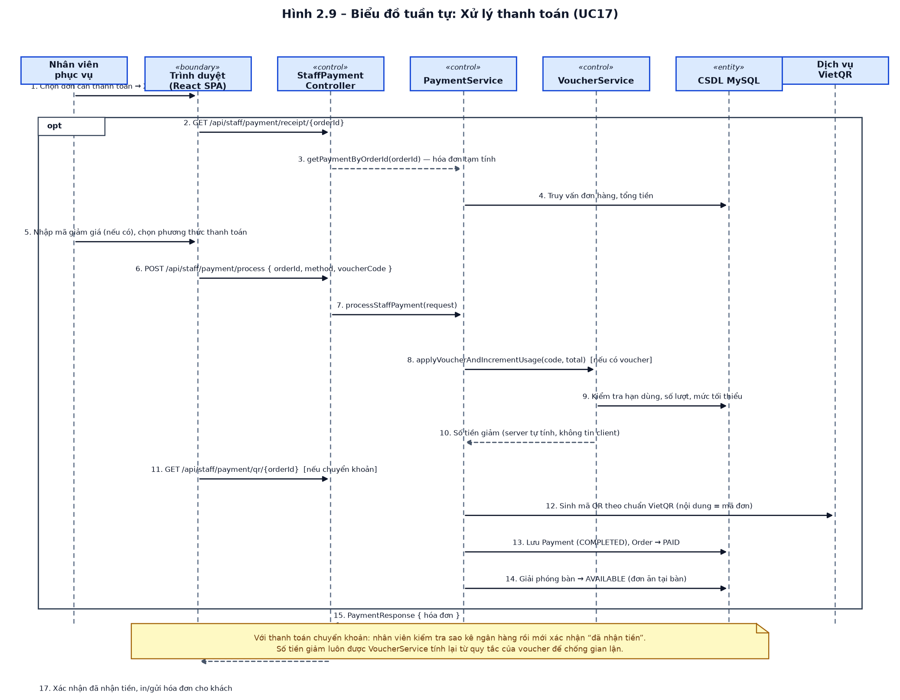

**Mô tả Hình 2.9:** Nhân viên chọn đơn → xem trước hóa đơn (`GET /api/staff/payment/receipt/{orderId}`) → nhập voucher (nếu có), chọn phương thức → `POST /api/staff/payment/process`. PaymentService gọi VoucherService kiểm tra hạn dùng/số lượt/điều kiện rồi **tính số tiền giảm phía máy chủ** (chống gian lận). Nếu chuyển khoản → sinh mã QR VietQR (nội dung = mã đơn). Cuối cùng lưu `Payment` (`COMPLETED`), đơn → `PAID`, giải phóng bàn (`AVAILABLE`), trả hóa đơn.

---

## 7. Biểu đồ hành động (Activity Diagram)

### 7.1. Luồng đặt món của Khách hàng

**Hình 2.10 – Biểu đồ hành động: Luồng đặt món của Khách hàng**

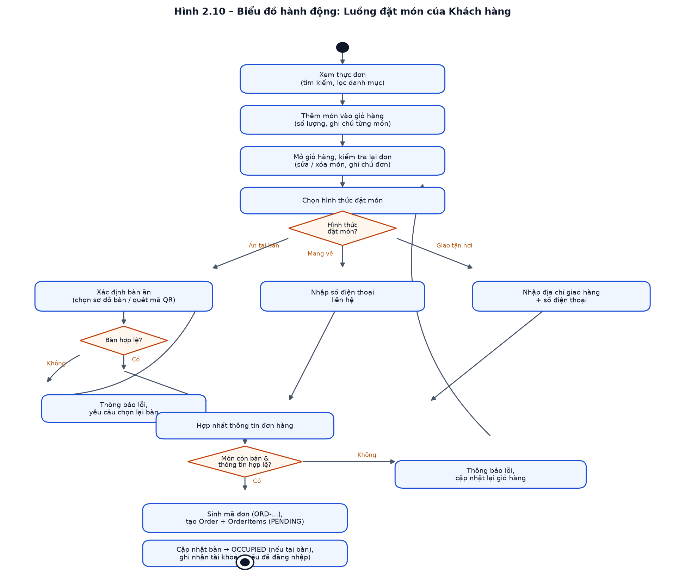

**Mô tả Hình 2.10:** Bắt đầu từ xem thực đơn → thêm món vào giỏ → kiểm tra lại đơn → chọn hình thức đặt. Nhánh quyết định "Hình thức đặt món": **Ăn tại bàn** (xác định bàn qua sơ đồ/QR, kiểm tra bàn hợp lệ — sai thì yêu cầu chọn lại), **Mang về** (nhập SĐT), **Giao tận nơi** (nhập địa chỉ + SĐT). Hợp nhất → kiểm tra "Món còn bán & thông tin hợp lệ": sai → báo lỗi, quay lại giỏ; đúng → sinh mã đơn, tạo `Order`+`OrderItems` (`PENDING`), cập nhật bàn `OCCUPIED`, ghi nhận tài khoản (nếu đã đăng nhập).

### 7.2. Luồng xử lý thanh toán tại quầy

**Hình 2.11 – Biểu đồ hành động: Luồng xử lý thanh toán tại quầy**

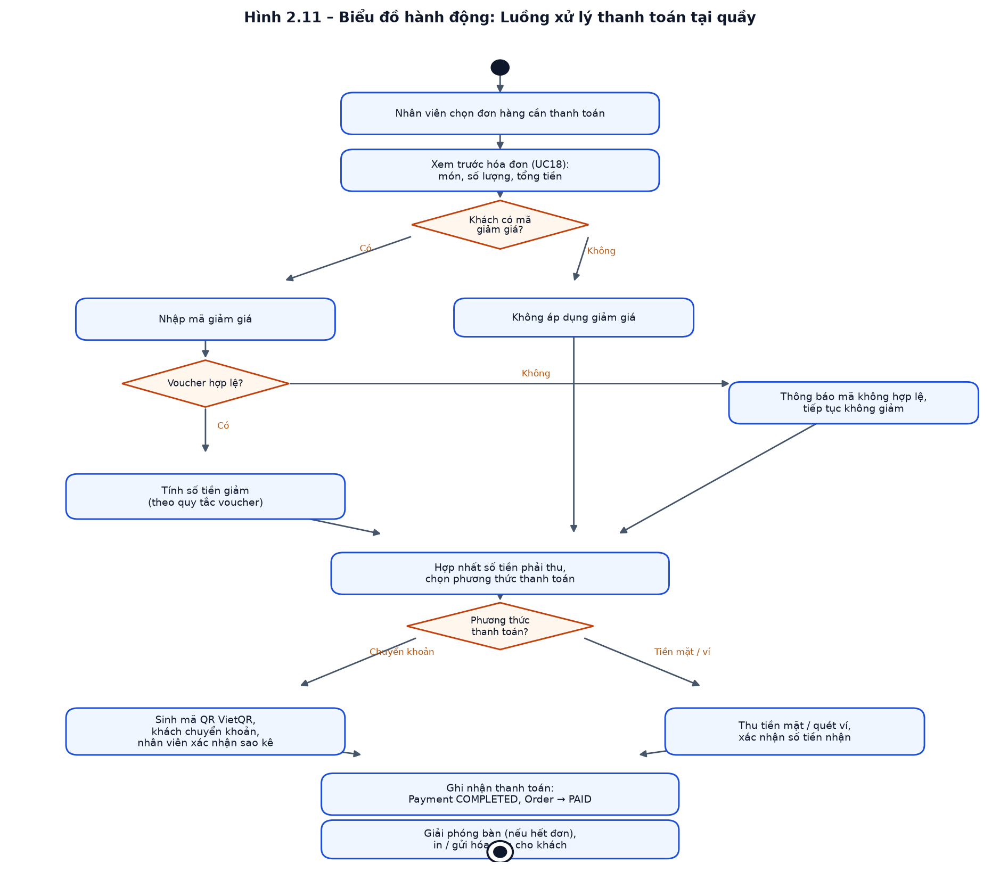

**Mô tả Hình 2.11:** Nhân viên chọn đơn → xem trước hóa đơn → kiểm tra "Khách có mã giảm giá?": có → nhập mã, kiểm tra voucher hợp lệ → tính tiền giảm (không hợp lệ → thông báo, tiếp tục không giảm); không → bỏ qua giảm giá. Hợp nhất số tiền phải thu, chọn phương thức: **Chuyển khoản** (sinh QR VietQR, khách chuyển khoản, NV xác nhận sao kê) hoặc **Tiền mặt/ví**. Cuối cùng ghi nhận thanh toán (`Payment COMPLETED`, `Order PAID`), giải phóng bàn, in/gửi hóa đơn.

---

## 8. Biểu đồ thành phần & Biểu đồ triển khai

### 8.1. Biểu đồ thành phần

**Hình 2.12 – Biểu đồ thành phần của hệ thống**

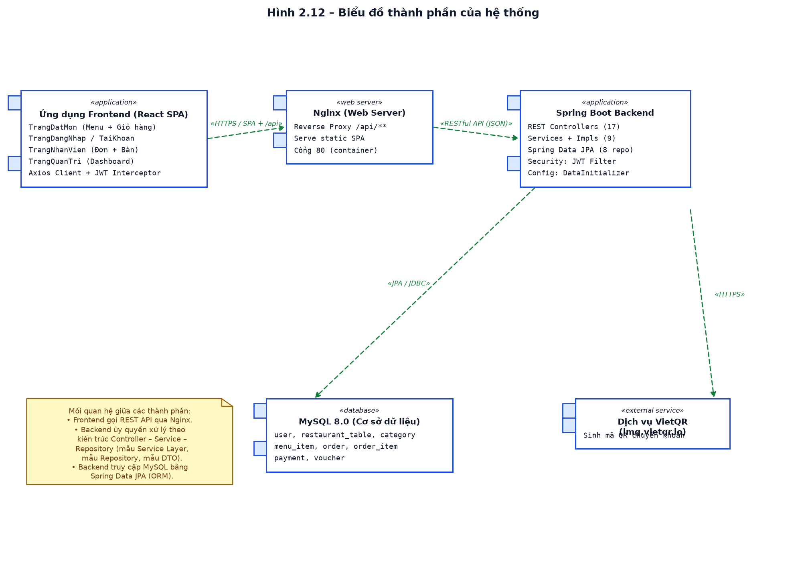

**Mô tả Hình 2.12:** 5 thành phần: **Frontend (React SPA)** gọi REST API qua **Nginx** (reverse proxy `/api/**` + serve static SPA) đến **Spring Boot Backend** (Controllers, Services, JPA, Security JWT, Config); Backend truy cập **MySQL 8.0** bằng Spring Data JPA (JDBC) và kết nối **Dịch vụ VietQR** (bên ngoài) qua HTTPS để sinh mã QR.

### 8.2. Biểu đồ triển khai

**Hình 2.13 – Biểu đồ triển khai của hệ thống**

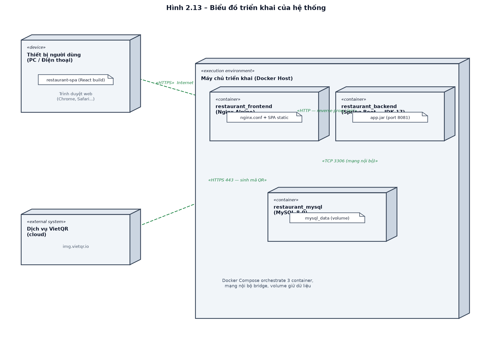

**Mô tả Hình 2.13:** Triển khai theo Docker Compose. **Thiết bị người dùng** (trình duyệt) → **Docker Host** chạy 3 container: `restaurant_frontend` (Nginx Alpine, cổng 80), `restaurant_backend` (Spring Boot, JDK 17, cổng 8081), `restaurant_mysql` (MySQL 8.0, volume `mysql_data`). Backend kết nối **Dịch vụ VietQR** (cloud) qua HTTPS 443. Kênh truyền: HTTPS (user→Nginx), HTTP (Nginx→backend), TCP 3306 (backend→MySQL, mạng nội bộ).

---

## 9. Luồng nghiệp vụ kho tự động (tổng kết)

```
[Nhập hàng]   Tạo ĐNP (PENDING) ──Duyệt──▶ stock SPCT (+ quantity)
[Bán hàng]    Đặt món (PENDING) ──Bếp xử lý──▶ Đọc TPSP ──Thanh toán──▶ stock SPCT (−)
```

| Giai đoạn | Sự kiện | Ảnh hưởng kho |
| :--- | :--- | :--- |
| Nhập | Duyệt phiếu nhập (`complete`) | **Cộng** tồn SPCT theo số lượng nhập |
| Bán | Xác nhận thanh toán (`processPayment`) | **Trừ** tồn SPCT theo định mức công thức TPSP |

---

*Hết nội dung Phân tích & Thiết kế hệ thống.*
