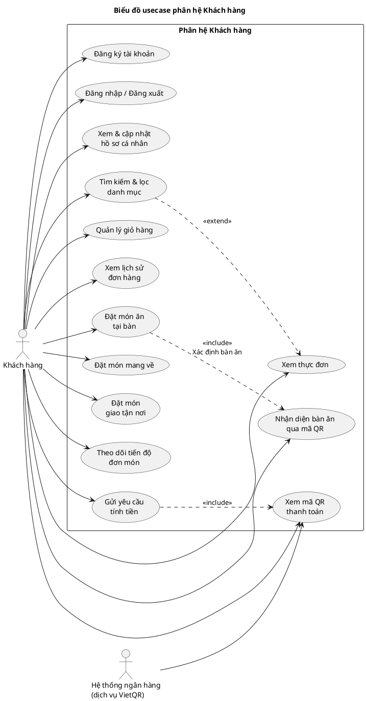

# 2.2. PHÂN TÍCH VÀ THIẾT KẾ CÁC CHỨC NĂNG

Dựa trên kết quả khảo sát yêu cầu ở mục 2.1, mục 2.2 tiến hành xác định các chức năng của hệ thống thông qua việc mô tả biểu đồ usecase tổng quát và đặc tả chi tiết từng usecase. Toàn bộ chức năng của hệ thống được tổ chức theo bốn nhóm: nhóm chức năng dùng chung (đăng ký, đăng nhập, quản lý hồ sơ), nhóm chức năng dành cho Khách hàng, nhóm chức năng dành cho Nhân viên phục vụ và nhóm chức năng dành cho Quản trị viên.

## 2.2.1. Xác định các tác nhân của hệ thống (Actors)

Tác nhân (Actor) của hệ thống là các đối tượng bên ngoài hệ thống có mối quan hệ tương tác với các chức năng của hệ thống. Qua phân tích yêu cầu, hệ thống xác định bốn tác nhân như sau:

**Bảng 2.1 – Danh sách các tác nhân của hệ thống**

| STT | Tác nhân | Ký hiệu | Mô tả |
|---|---|---|---|
| 1 | Khách hàng | KH | Người sử dụng hệ thống để xem thực đơn, đặt món, theo dõi đơn hàng và thanh toán. Khách hàng bao gồm *khách vãng lai* (không cần tài khoản vẫn xem được thực đơn và đặt món) và *khách có tài khoản* (đăng nhập để lưu lịch sử đơn hàng, quản lý hồ sơ). |
| 2 | Nhân viên phục vụ | NV | Nhân viên trực tại nhà hàng: tiếp nhận đơn món, cập nhật trạng thái chế biến của từng món, quản lý trạng thái bàn ăn, xác nhận thanh toán và giải phóng bàn. |
| 3 | Quản trị viên | QT | Người quản lý toàn bộ dữ liệu nghiệp vụ của hệ thống: danh mục món ăn, món ăn, bàn ăn, tài khoản người dùng, khuyến mãi, đơn hàng và thống kê báo cáo doanh thu. |
| 4 | Hệ thống ngân hàng (dịch vụ VietQR) | NH | Tác nhân bên ngoài hệ thống. Hệ thống sử dụng dịch vụ sinh mã QR theo chuẩn VietQR để tạo mã chuyển khoản kèm số tiền và nội dung chuyển khoản; khách hàng quét mã bằng ứng dụng ngân hàng bất kỳ để thanh toán. |

*Ghi chú:* Về mặt phân quyền truy cập, hệ thống quản lý ba vai trò tài khoản (`ADMIN`, `STAFF`, `CUSTOMER`) tương ứng với ba tác nhân con người; riêng Khách hàng vãng lai không yêu cầu đăng nhập đối với các chức năng xem thực đơn và đặt món.

## 2.2.2. Xác định các chức năng của hệ thống

Dựa vào yêu cầu nghiệp vụ của nhà hàng, hệ thống được phân rã thành 27 usecase, chia thành bốn nhóm như bảng sau:

**Bảng 2.2 – Danh mục các usecase của hệ thống**

| Mã UC | Tên usecase | Actor chính | Mô tả ngắn |
|---|---|---|---|
| UC01 | Đăng ký tài khoản | Khách hàng | Tạo tài khoản mới với vai trò Khách hàng (CUSTOMER). |
| UC02 | Đăng nhập hệ thống | Khách hàng, Nhân viên, Quản trị viên | Xác thực danh tính, cấp mã thông báo JWT và điều hướng theo vai trò. |
| UC03 | Đăng xuất | Khách hàng, Nhân viên, Quản trị viên | Kết thúc phiên làm việc, hủy mã thông báo phía trình duyệt. |
| UC04 | Xem và cập nhật hồ sơ cá nhân | Khách hàng | Xem, chỉnh sửa họ tên, email, số điện thoại, địa chỉ. |
| UC05 | Xem thực đơn | Khách hàng | Xem danh sách món ăn kèm giá, mô tả, hình ảnh; tìm kiếm theo tên và lọc theo danh mục. |
| UC06 | Nhận diện bàn ăn qua mã QR | Khách hàng | Quét mã QR tại bàn, hệ thống tự nhận diện và gán bàn cho phiên đặt món. |
| UC07 | Quản lý giỏ hàng | Khách hàng | Thêm, sửa, xóa món; chọn số lượng; ghi chú cho từng món và cho đơn hàng. |
| UC08 | Đặt món | Khách hàng | Gửi đơn món với ba hình thức: ăn tại bàn, mang về, giao tận nơi. |
| UC09 | Theo dõi tiến độ đơn món | Khách hàng | Theo dõi trạng thái đơn hàng và từng món ăn theo thời gian thực. |
| UC10 | Gửi yêu cầu tính tiền | Khách hàng | Báo cho nhân viên biết khách cần thanh toán, bàn chuyển sang trạng thái chờ tính tiền. |
| UC11 | Xem mã QR thanh toán VietQR | Khách hàng | Xem mã QR chuyển khoản kèm số tiền và nội dung chuyển khoản của đơn hàng. |
| UC12 | Xem lịch sử đơn hàng | Khách hàng | Xem danh sách các đơn hàng đã đặt của tài khoản. |
| UC13 | Xem danh sách đơn hàng đang xử lý | Nhân viên phục vụ | Xem toàn bộ đơn hàng đang hoạt động theo thời gian thực. |
| UC14 | Cập nhật trạng thái đơn hàng | Nhân viên phục vụ | Chuyển trạng thái đơn hàng qua các bước xử lý. |
| UC15 | Cập nhật trạng thái từng món ăn | Nhân viên phục vụ | Cập nhật quy trình chế biến từng món: chờ xử lý → đang chế biến → đã xong → đã lên món. |
| UC16 | Quản lý trạng thái bàn ăn | Nhân viên phục vụ | Chuyển trạng thái bàn: trống → có khách → chờ tính tiền và giải phóng bàn. |
| UC17 | Xử lý thanh toán | Nhân viên phục vụ | Xác nhận thanh toán bằng tiền mặt, chuyển khoản; áp dụng mã giảm giá; giải phóng bàn. |
| UC18 | Xem trước hóa đơn | Nhân viên phục vụ | Xem chi tiết đơn hàng, tổng tiền và tiền giảm trước khi xác nhận thanh toán. |
| UC19 | Sinh mã QR chuyển khoản | Nhân viên phục vụ, Hệ thống ngân hàng | Tạo mã VietQR cho đơn hàng để khách quét và chuyển khoản. |
| UC20 | Kiểm tra mã giảm giá | Nhân viên phục vụ | Kiểm tra tính hợp lệ của voucher và tính số tiền được giảm. |
| UC21 | Quản lý danh mục món ăn | Quản trị viên | Thêm, sửa, xóa, bật/tắt các nhóm món ăn (khai vị, món chính, tráng miệng, đồ uống...). |
| UC22 | Quản lý món ăn | Quản trị viên | Thêm, sửa, xóa món ăn; cập nhật giá, mô tả, hình ảnh; chuyển đổi còn món / hết món. |
| UC23 | Quản lý bàn ăn | Quản trị viên | Thêm, sửa, xóa bàn ăn; cấu hình sức chứa; sinh mã QR cho từng bàn. |
| UC24 | Quản lý người dùng | Quản trị viên | Thêm, sửa, xóa tài khoản; phân quyền vai trò; khóa/mở tài khoản. |
| UC25 | Quản lý khuyến mãi | Quản trị viên | Tạo và quản lý mã giảm giá theo phần trăm hoặc số tiền cố định, kèm thời hạn và số lượt dùng. |
| UC26 | Quản lý đơn hàng | Quản trị viên | Xem toàn bộ đơn hàng, lọc theo trạng thái, cập nhật trạng thái đơn hàng. |
| UC27 | Xem thống kê, báo cáo | Quản trị viên | Xem tổng doanh thu, số đơn hàng, tỉ lệ hoàn thành, món bán chạy, cơ cấu doanh thu theo phương thức thanh toán. |

## 2.2.3. Biểu đồ usecase tổng quát

### 2.2.3.1. Biểu đồ usecase tổng quát toàn hệ thống

Hình 2.1 thể hiện biểu đồ usecase tổng quát của toàn hệ thống, mô tả bốn tác nhân và các chức năng cấp cao mà từng tác nhân tham gia. Trong biểu đồ này, một số chức năng có cùng phạm vi nghiệp vụ được gộp lại ở mức tổng quan (ví dụ: *Quản lý đơn món & quy trình bếp* bao gồm việc xem đơn, cập nhật trạng thái đơn hàng và cập nhật trạng thái từng món ăn); việc phân rã chi tiết được thể hiện ở các biểu đồ usecase theo từng phân hệ (Hình 2.2, Hình 2.3, Hình 2.4) và trong bảng đặc tả usecase (mục 2.2.4).


**Mô tả biểu đồ Hình 2.1:**

- Tác nhân *Khách hàng* tham gia 9 usecase: xem thực đơn (kèm tìm kiếm, lọc danh mục), quản lý giỏ hàng, đặt món (đa hình thức), theo dõi tiến độ đơn món, gửi yêu cầu tính tiền, thanh toán qua mã VietQR, xem lịch sử đơn hàng, đăng nhập và đăng ký tài khoản.
- Tác nhân *Nhân viên phục vụ* tham gia 4 usecase: quản lý đơn món & quy trình bếp, quản lý trạng thái bàn ăn, xử lý thanh toán và đăng nhập hệ thống.
- Tác nhân *Quản trị viên* tham gia 7 usecase: quản lý danh mục & món ăn, quản lý bàn ăn, quản lý người dùng, quản lý khuyến mãi, quản lý đơn hàng, thống kê & báo cáo và đăng nhập hệ thống.
- Tác nhân *Hệ thống ngân hàng (dịch vụ VietQR)* là tác nhân ngoài hệ thống, tham gia vào luồng thanh toán qua mã VietQR: hệ thống sinh mã QR theo chuẩn VietQR, khách hàng quét mã bằng ứng dụng ngân hàng để chuyển khoản với nội dung chuyển khoản chính là mã đơn hàng, giúp nhân viên dễ dàng đối soát.

### 2.2.3.2. Biểu đồ usecase phân hệ Khách hàng


**Mô tả biểu đồ Hình 2.2:** Biểu đồ thể hiện chi tiết các chức năng của Khách hàng, bao gồm nhóm chức năng tài khoản (đăng ký, đăng nhập/đăng xuất, xem & cập nhật hồ sơ), nhóm chức năng khám phá thực đơn (xem thực đơn, tìm kiếm & lọc danh mục là quan hệ «extend», nhận diện bàn ăn qua mã QR), nhóm chức năng đặt món (đặt món ăn tại bàn có «include» bước xác định bàn ăn; đặt món mang về; đặt món giao tận nơi) và nhóm chức năng theo dõi – thanh toán (theo dõi tiến độ đơn món, gửi yêu cầu tính tiền có «include» xem mã QR thanh toán). Hệ thống ngân hàng tham gia vào usecase xem mã QR thanh toán.

### 2.2.3.3. Biểu đồ usecase phân hệ Nhân viên phục vụ


**Mô tả biểu đồ Hình 2.3:** Biểu đồ thể hiện các chức năng của Nhân viên phục vụ: đăng nhập/đăng xuất, xem danh sách đơn hàng đang xử lý, cập nhật trạng thái đơn hàng, cập nhật trạng thái từng món ăn (quy trình bếp), quản lý trạng thái bàn ăn và nhóm chức năng thanh toán. Use case *Xử lý thanh toán* có quan hệ «include» với *Xác thực mã giảm giá*, *Xác nhận thanh toán & giải phóng bàn* và *Xem trước hóa đơn*; đồng thời có quan hệ «extend» với *Sinh mã QR chuyển khoản* (chỉ phát sinh khi khách chọn thanh toán bằng chuyển khoản ngân hàng).

### 2.2.3.4. Biểu đồ usecase phân hệ Quản trị viên


**Mô tả biểu đồ Hình 2.4:** Biểu đồ thể hiện các chức năng quản trị của Quản trị viên: đăng nhập/đăng xuất, quản lý danh mục món ăn, quản lý món ăn, quản lý bàn ăn, quản lý người dùng (usecase *Khóa / mở tài khoản* là quan hệ «extend» của chức năng quản lý người dùng), quản lý khuyến mãi, quản lý đơn hàng và xem thống kê, báo cáo doanh thu.

### 2.2.3.5. Các quan hệ giữa các usecase

**Bảng 2.3 – Tổng hợp các quan hệ «include» / «extend» giữa các usecase**

| Usecase nguồn | Quan hệ | Usecase đích | Giải thích |
|---|---|---|---|
| UC08 – Đặt món ăn tại bàn | «include» | UC06 – Nhận diện bàn ăn qua mã QR | Khi đặt món ăn tại bàn, hệ thống bắt buộc phải xác định bàn ăn (chọn trên sơ đồ bàn hoặc nhận diện từ mã QR). |
| UC05 – Tìm kiếm & lọc danh mục | «extend» | UC05 – Xem thực đơn | Tìm kiếm theo tên và lọc theo danh mục là chức năng mở rộng, không bắt buộc khi xem thực đơn. |
| UC10 – Gửi yêu cầu tính tiền | «include» | UC11 – Xem mã QR thanh toán | Sau khi gửi yêu cầu tính tiền, khách hàng có thể xem mã QR chuyển khoản để chủ động thanh toán. |
| UC17 – Xử lý thanh toán | «include» | UC20 – Kiểm tra mã giảm giá | Khi có mã giảm giá, hệ thống bắt buộc kiểm tra tính hợp lệ trước khi tính tiền. |
| UC17 – Xử lý thanh toán | «include» | UC18 – Xem trước hóa đơn | Trước khi xác nhận thanh toán, nhân viên xem trước hóa đơn để kiểm tra tổng tiền. |
| UC17 – Xử lý thanh toán | «include» | UC16 – Quản lý trạng thái bàn ăn | Thanh toán thành công, hệ thống tự động giải phóng bàn (đối với đơn ăn tại bàn). |
| UC19 – Sinh mã QR chuyển khoản | «extend» | UC17 – Xử lý thanh toán | Chỉ phát sinh khi khách chọn thanh toán bằng chuyển khoản ngân hàng. |
| UC24 – Khóa / mở tài khoản | «extend» | UC24 – Quản lý người dùng | Khóa/mở tài khoản là thao tác mở rộng của chức năng quản lý người dùng. |

## 2.2.4. Đặc tả usecase

Mỗi usecase được đặc tả theo các thuộc tính: mã usecase, tên usecase, actor chính, actor phụ, mô tả tổng quan, điều kiện tiên quyết, điều kiện hậu, luồng chính, luồng thay thế/mở rộng và ngoại lệ xử lý. Các trạng thái nghiệp vụ được sử dụng trong đặc tả gồm:

- Trạng thái đơn hàng: `Chờ xử lý (PENDING)` → `Đang xử lý (PROCESSING)` → `Hoàn thành (COMPLETED)` → `Đã thanh toán (PAID)`; ngoài ra có trạng thái `Đã hủy (CANCELLED)`.
- Trạng thái từng món ăn: `Chờ xử lý (PENDING)` → `Đang chế biến (PREPARING)` → `Đã xong (READY)` → `Đã lên món (SERVED)`.
- Trạng thái bàn ăn: `Trống (AVAILABLE)`, `Có khách (OCCUPIED)`, `Chờ tính tiền (PAYING)`.
- Phương thức thanh toán: `Tiền mặt (CASH)`, `Chuyển khoản (BANK_TRANSFER)`, `Ví điện tử (VNPAY)`.
- Hình thức đặt món: `Ăn tại bàn (DINE_IN)`, `Mang về (PICKUP)`, `Giao tận nơi (DELIVERY)`.

### A. Nhóm chức năng dùng chung

**Bảng 2.4. Đặc tả usecase UC01 – Đăng ký tài khoản**

| Thuộc tính | Nội dung |
|---|---|
| Mã usecase | UC01 |
| Tên usecase | Đăng ký tài khoản |
| Actor chính | Khách hàng |
| Actor phụ | — |
| Mô tả tổng quan | Khách hàng tạo tài khoản mới trong hệ thống để được lưu lịch sử đặt hàng và quản lý hồ sơ cá nhân. |
| Điều kiện tiên quyết | Khách hàng truy cập được trang Đăng ký và chưa có tài khoản trong hệ thống. |
| Điều kiện hậu | Hệ thống tạo tài khoản mới với vai trò Khách hàng (CUSTOMER), trạng thái hoạt động (ACTIVE). |
| Luồng chính | 1. Khách hàng chọn chức năng *Đăng ký*. <br> 2. Hệ thống hiển thị biểu mẫu đăng ký. <br> 3. Khách hàng nhập tên đăng nhập, mật khẩu, họ và tên, email, số điện thoại (địa chỉ có thể cập nhật sau). <br> 4. Hệ thống kiểm tra tính hợp lệ của dữ liệu: tên đăng nhập chưa tồn tại, email đúng định dạng, mật khẩu đạt yêu cầu độ dài. <br> 5. Hệ thống tạo tài khoản với vai trò CUSTOMER. <br> 6. Hệ thống thông báo đăng ký thành công và chuyển hướng đến trang Đăng nhập. |
| Luồng thay thế / mở rộng | — |
| Ngoại lệ & xử lý | 3a. Tên đăng nhập đã tồn tại: hệ thống báo lỗi, yêu cầu chọn tên đăng nhập khác. <br> 4a. Email sai định dạng hoặc đã được sử dụng: hệ thống báo lỗi cụ thể. <br> 4b. Mật khẩu và xác nhận mật khẩu không khớp: hệ thống yêu cầu nhập lại. |
| Quy tắc nghiệp vụ | Tài khoản đăng ký qua chức năng này luôn mang vai trò CUSTOMER; chỉ Quản trị viên mới tạo được tài khoản STAFF/ADMIN. |

**Bảng 2.5. Đặc tả usecase UC02 – Đăng nhập hệ thống**

| Thuộc tính | Nội dung |
|---|---|
| Mã usecase | UC02 |
| Tên usecase | Đăng nhập hệ thống |
| Actor chính | Khách hàng, Nhân viên phục vụ, Quản trị viên |
| Actor phụ | — |
| Mô tả tổng quan | Người dùng xác thực danh tính để sử dụng các chức năng theo vai trò của mình. |
| Điều kiện tiên quyết | Người dùng đã có tài khoản hợp lệ trong hệ thống. |
| Điều kiện hậu | Hệ thống cấp mã thông báo JWT cho phiên làm việc; giao diện điều hướng về phân hệ tương ứng với vai trò (trang quản trị cho ADMIN, trang vận hành cho STAFF, trang đặt món cho CUSTOMER). |
| Luồng chính | 1. Người dùng chọn chức năng *Đăng nhập*. <br> 2. Hệ thống hiển thị biểu mẫu đăng nhập. <br> 3. Người dùng nhập tên đăng nhập và mật khẩu. <br> 4. Hệ thống kiểm tra thông tin xác thực. <br> 5. Hệ thống sinh mã thông báo JWT kèm thông tin tài khoản (vai trò, trạng thái). <br> 6. Giao diện tự động đính kèm mã thông báo vào các yêu cầu mạng tiếp theo và điều hướng theo vai trò. |
| Luồng thay thế / mở rộng | 5a. Khách hàng chưa có tài khoản: chọn chức năng Đăng ký (UC01). |
| Ngoại lệ & xử lý | 4a. Tên đăng nhập hoặc mật khẩu không đúng: hệ thống báo lỗi, cho phép nhập lại. <br> 4b. Tài khoản ở trạng thái bị khóa (INACTIVE): hệ thống từ chối đăng nhập và thông báo tài khoản bị vô hiệu hóa. |
| Quy tắc nghiệp vụ | Mã thông báo JWT có thời hạn; khi hết hạn, hệ thống tự động yêu cầu đăng nhập lại. |

**Bảng 2.6. Đặc tả usecase UC03 – Đăng xuất**

| Thuộc tính | Nội dung |
|---|---|
| Mã usecase | UC03 |
| Tên usecase | Đăng xuất |
| Actor chính | Khách hàng, Nhân viên phục vụ, Quản trị viên |
| Actor phụ | — |
| Mô tả tổng quan | Người dùng chủ động kết thúc phiên làm việc với hệ thống. |
| Điều kiện tiên quyết | Người dùng đã đăng nhập. |
| Điều kiện hậu | Mã thông báo JWT bị xóa phía trình duyệt; người dùng quay về giao diện công khai (trang chủ / trang đặt món). |
| Luồng chính | 1. Người dùng chọn chức năng *Đăng xuất*. <br> 2. Hệ thống xóa thông tin phiên làm việc (mã thông báo, thông tin người dùng) phía trình duyệt. <br> 3. Hệ thống chuyển hướng về trang công khai. |
| Luồng thay thế / mở rộng | — |
| Ngoại lệ & xử lý | Mã thông báo đã hết hạn trước đó: hệ thống vẫn xóa phiên và chuyển hướng về trang đăng nhập. |
| Quy tắc nghiệp vụ | Do hệ thống theo mô hình không lưu trạng thái (Stateless), việc đăng xuất được thực hiện bằng cách hủy mã thông báo phía máy khách. |

**Bảng 2.7. Đặc tả usecase UC04 – Xem và cập nhật hồ sơ cá nhân**

| Thuộc tính | Nội dung |
|---|---|
| Mã usecase | UC04 |
| Tên usecase | Xem và cập nhật hồ sơ cá nhân |
| Actor chính | Khách hàng |
| Actor phụ | — |
| Mô tả tổng quan | Khách hàng xem thông tin cá nhân của mình và cập nhật các thông tin thay đổi. |
| Điều kiện tiên quyết | Khách hàng đã đăng nhập bằng tài khoản hợp lệ. |
| Điều kiện hậu | Thông tin cá nhân được cập nhật trong cơ sở dữ liệu. |
| Luồng chính | 1. Khách hàng mở trang tài khoản cá nhân. <br> 2. Hệ thống hiển thị thông tin hiện tại (tên đăng nhập, họ tên, email, số điện thoại, địa chỉ). <br> 3. Khách hàng chỉnh sửa các thông tin cần thay đổi. <br> 4. Hệ thống kiểm tra tính hợp lệ của dữ liệu. <br> 5. Hệ thống lưu thay đổi và thông báo cập nhật thành công. |
| Luồng thay thế / mở rộng | 3a. Khách hàng không thay đổi gì: kết thúc khi rời trang. |
| Ngoại lệ & xử lý | 4a. Dữ liệu không hợp lệ (email sai định dạng, số điện thoại không đúng dạng...): hệ thống báo lỗi, giữ nguyên thông tin cũ. |
| Quy tắc nghiệp vụ | Tên đăng nhập và vai trò của tài khoản không thể thay đổi tại chức năng này. |

### B. Nhóm chức năng dành cho Khách hàng

**Bảng 2.8. Đặc tả usecase UC05 – Xem thực đơn**

| Thuộc tính | Nội dung |
|---|---|
| Mã usecase | UC05 |
| Tên usecase | Xem thực đơn (kèm tìm kiếm & lọc danh mục) |
| Actor chính | Khách hàng |
| Actor phụ | — |
| Mô tả tổng quan | Khách hàng xem toàn bộ thực đơn của nhà hàng dưới dạng lưới, xem chi tiết từng món và tùy chọn tìm kiếm theo tên, lọc theo danh mục. |
| Điều kiện tiên quyết | Khách hàng truy cập được trang thực đơn (không yêu cầu đăng nhập). |
| Điều kiện hậu | Khách hàng nắm được thông tin món ăn (tên, giá, mô tả, hình ảnh, danh mục) để đưa ra lựa chọn đặt món. |
| Luồng chính | 1. Khách hàng truy cập trang thực đơn. <br> 2. Hệ thống tải danh sách danh mục và danh sách món ăn đang còn bán (trạng thái AVAILABLE). <br> 3. Hệ thống hiển thị thực đơn dạng lưới kèm giá, mô tả và hình ảnh. <br> 4. Khách hàng chọn một món để xem chi tiết (giá đầy đủ, mô tả, hình ảnh). |
| Luồng thay thế / mở rộng | 3a. *Tìm kiếm theo tên* («extend»): khách hàng nhập từ khóa, hệ thống hiển thị các món có tên phù hợp. <br> 3b. *Lọc theo danh mục* («extend»): khách hàng chọn một danh mục (khai vị, món chính, tráng miệng, đồ uống...), hệ thống hiển thị các món thuộc danh mục đó. |
| Ngoại lệ & xử lý | 2a. Không có món nào còn bán: hệ thống hiển thị thông báo thực đơn trống. <br> 3a'. Từ khóa tìm kiếm không có kết quả: hệ thống thông báo không tìm thấy món phù hợp. |
| Quy tắc nghiệp vụ | Chỉ hiển thị các món ở trạng thái *Còn món (AVAILABLE)*; món *Hết món (UNAVAILABLE)* không xuất hiện trong thực đơn khách hàng. |

**Bảng 2.9. Đặc tả usecase UC06 – Nhận diện bàn ăn qua mã QR**

| Thuộc tính | Nội dung |
|---|---|
| Mã usecase | UC06 |
| Tên usecase | Nhận diện bàn ăn qua mã QR |
| Actor chính | Khách hàng |
| Actor phụ | — |
| Mô tả tổng quan | Khách hàng quét mã QR được dán tại bàn ăn; hệ thống tự nhận diện bàn và gán bàn đó cho phiên đặt món, giúp khách không phải chọn bàn thủ công. |
| Điều kiện tiên quyết | Bàn ăn đã được tạo trong hệ thống và đã được sinh mã QR (UC23). |
| Điều kiện hậu | Hệ thống xác định được bàn khách đang ngồi; thông tin bàn được tự động điền vào đơn món. |
| Luồng chính | 1. Khách hàng quét mã QR tại bàn bằng điện thoại. <br> 2. Trình duyệt mở địa chỉ trang thực đơn kèm mã số bàn (ví dụ: `/menu?tableId=1`). <br> 3. Hệ thống đọc tham số bàn, kiểm tra bàn có tồn tại hay không. <br> 4. Hệ thống tự gán bàn cho phiên đặt món và hiển thị thông tin bàn trên giao diện. |
| Luồng thay thế / mở rộng | 4a. Khách hàng muốn đổi bàn: có thể chọn bàn khác trên sơ đồ bàn trước khi đặt món. |
| Ngoại lệ & xử lý | 3a. Mã bàn không tồn tại (bàn đã bị xóa hoặc mã sai): hệ thống bỏ qua tham số, yêu cầu khách chọn bàn thủ công. |
| Quy tắc nghiệp vụ | Mã QR của mỗi bàn là duy nhất, được sinh theo định danh của bàn trong hệ thống. |

**Bảng 2.10. Đặc tả usecase UC07 – Quản lý giỏ hàng**

| Thuộc tính | Nội dung |
|---|---|
| Mã usecase | UC07 |
| Tên usecase | Quản lý giỏ hàng |
| Actor chính | Khách hàng |
| Actor phụ | — |
| Mô tả tổng quan | Khách hàng xây dựng danh sách món cần đặt trước khi gửi đơn hàng. |
| Điều kiện tiên quyết | Khách hàng đang ở trang thực đơn hoặc trang chi tiết món. |
| Điều kiện hậu | Giỏ hàng chứa danh sách món, số lượng, ghi chú và tổng tiền tạm tính, sẵn sàng để gửi thành đơn hàng. |
| Luồng chính | 1. Khách hàng chọn món và thêm vào giỏ hàng. <br> 2. Hệ thống cập nhật giỏ hàng (số lượng, thành tiền từng món, tổng tiền tạm tính). <br> 3. Khách hàng mở giỏ hàng (mảng trượt từ cạnh phải màn hình). <br> 4. Khách hàng chỉnh sửa số lượng, thêm ghi chú cho từng món (ví dụ: *ít đường, không cay*) hoặc ghi chú cho đơn hàng. <br> 5. Khách hàng xóa món không muốn đặt. |
| Luồng thay thế / mở rộng | 1a. Khách hàng thêm cùng một món nhiều lần: hệ thống cộng dồn số lượng. |
| Ngoại lệ & xử lý | 1a'. Món đã hết món tại thời điểm thêm: hệ thống không cho phép thêm vào giỏ. <br> 4a. Số lượng không hợp lệ (nhỏ hơn 1): hệ thống yêu cầu nhập lại. |
| Quy tắc nghiệp vụ | Giỏ hàng được lưu phía trình duyệt; khách vãng lai và khách đã đăng nhập đều sử dụng được. |

**Bảng 2.11. Đặc tả usecase UC08 – Đặt món**

| Thuộc tính | Nội dung |
|---|---|
| Mã usecase | UC08 |
| Tên usecase | Đặt món (đa hình thức) |
| Actor chính | Khách hàng |
| Actor phụ | — |
| Mô tả tổng quan | Khách hàng gửi đơn món đến nhà hàng với một trong ba hình thức: ăn tại bàn, mang về, giao tận nơi. |
| Điều kiện tiên quyết | Giỏ hàng có ít nhất một món (UC07); với đơn ăn tại bàn đã xác định được bàn (UC06 hoặc chọn tay); với đơn giao tận nơi đã có địa chỉ giao hàng. |
| Điều kiện hậu | Hệ thống tạo đơn hàng với trạng thái *Chờ xử lý (PENDING)*, sinh mã đơn hàng duy nhất (dạng `ORD-...`), ghi nhận các món trong đơn; bàn ăn chuyển sang trạng thái *Có khách* (đơn ăn tại bàn); nếu khách đã đăng nhập, đơn hàng được gắn với tài khoản để lưu lịch sử. |
| Luồng chính | 1. Khách hàng mở giỏ hàng và chọn chức năng *Đặt món*. <br> 2. Khách hàng chọn hình thức đặt món: *Ăn tại bàn* / *Mang về* / *Giao tận nơi*. <br> 3. Khách hàng cung cấp thông tin theo hình thức: chọn bàn (hoặc quét mã QR), nhập số điện thoại liên hệ, hoặc nhập địa chỉ giao hàng; tùy chọn ghi chú đơn hàng. <br> 4. Hệ thống kiểm tra giỏ hàng và thông tin bắt buộc theo từng hình thức. <br> 5. Hệ thống kiểm tra toàn bộ món trong giỏ còn ở trạng thái *Còn món*. <br> 6. Hệ thống sinh mã đơn hàng, khởi tạo đơn hàng và các món ăn trong đơn (mỗi món ở trạng thái *Chờ xử lý*), tính tổng tiền theo giá hiện tại. <br> 7. Hệ thống thông báo đặt món thành công kèm mã đơn hàng và chuyển sang màn hình theo dõi đơn (UC09). |
| Luồng thay thế / mở rộng | 2a. *Ăn tại bàn*: bắt buộc có bàn hợp lệ; nếu bàn đang trống, hệ thống chuyển bàn sang trạng thái *Có khách*. <br> 2b. *Mang về*: chỉ cần số điện thoại liên hệ, không cần bàn. <br> 2c. *Giao tận nơi*: bắt buộc có địa chỉ giao hàng và số điện thoại liên hệ. <br> 3a. Khách chưa đăng nhập vẫn đặt món được; nếu muốn lưu lịch sử, khách có thể đăng nhập trước khi đặt. |
| Ngoại lệ & xử lý | 4a. Đơn ăn tại bàn mà thiếu thông tin bàn: hệ thống yêu cầu chọn bàn trước khi gửi. <br> 4b. Đơn giao tận nơi mà thiếu địa chỉ: hệ thống yêu cầu nhập địa chỉ giao hàng. <br> 5a. Có món đã chuyển sang *Hết món*: hệ thống báo tên món bị loại, yêu cầu cập nhật giỏ hàng. |
| Quy tắc nghiệp vụ | Đơn giá từng món được chốt theo giá tại thời điểm đặt; mã đơn hàng là duy nhất, dùng để tra cứu, đối soát và tạo nội dung chuyển khoản thanh toán. |

**Bảng 2.12. Đặc tả usecase UC09 – Theo dõi tiến độ đơn món**

| Thuộc tính | Nội dung |
|---|---|
| Mã usecase | UC09 |
| Tên usecase | Theo dõi tiến độ đơn món |
| Actor chính | Khách hàng |
| Actor phụ | — |
| Mô tả tổng quan | Khách hàng theo dõi trạng thái đơn hàng và từng món ăn trong đơn theo thời gian thực từ khi gửi đơn đến khi hoàn tất. |
| Điều kiện tiên quyết | Khách hàng đã đặt món thành công và có mã đơn hàng (hoặc đã đăng nhập để xem đơn của mình). |
| Điều kiện hậu | Khách hàng nắm được tiến độ chế biến và lên món. |
| Luồng chính | 1. Hệ thống hiển thị đơn hàng với trạng thái hiện tại của đơn và của từng món. <br> 2. Hệ thống tự động đồng bộ dữ liệu theo chu kỳ để cập nhật thay đổi từ nhà bếp và nhân viên. <br> 3. Khách hàng quan sát quy trình: từng món chuyển từ *Chờ xử lý* → *Đang chế biến* → *Đã xong* → *Đã lên món*; đơn hàng chuyển theo tiến độ xử lý cho đến khi thanh toán. |
| Luồng thay thế / mở rộng | 3a. Khách hàng theo dõi bằng mã đơn hàng (tra cứu theo mã) hoặc theo danh sách đơn của tài khoản (UC12). |
| Ngoại lệ & xử lý | 2a. Mất kết nối mạng: hệ thống giữ dữ liệu cũ và tiếp tục thử đồng bộ. |
| Quy tắc nghiệp vụ | Trạng thái đơn hàng chỉ do Nhân viên phục vụ và Quản trị viên thay đổi; khách hàng chỉ xem. |

**Bảng 2.13. Đặc tả usecase UC10 – Gửi yêu cầu tính tiền**

| Thuộc tính | Nội dung |
|---|---|
| Mã usecase | UC10 |
| Tên usecase | Gửi yêu cầu tính tiền |
| Actor chính | Khách hàng |
| Actor phụ | Nhân viên phục vụ |
| Mô tả tổng quan | Khách hàng chủ động báo cho nhân viên biết mình cần thanh toán để được phục vụ tính tiền. |
| Điều kiện tiên quyết | Khách hàng đang có đơn món ăn tại bàn chưa thanh toán. |
| Điều kiện hậu | Bàn ăn chuyển sang trạng thái *Chờ tính tiền (PAYING)*; nhân viên nhận biết được yêu cầu để tiến hành thanh toán (UC17). |
| Luồng chính | 1. Khách hàng chọn chức năng *Yêu cầu tính tiền* trên giao diện theo dõi đơn. <br> 2. Hệ thống ghi nhận yêu cầu và chuyển trạng thái bàn sang *Chờ tính tiền*. <br> 3. Hệ thống hiển thị thông tin thanh toán cho khách (sơ đồ bàn phía nhân viên thể hiện bàn cần tính tiền bằng màu cảnh báo). <br> 4. Khách hàng có thể xem mã QR thanh toán (UC11) trong khi chờ nhân viên. |
| Luồng thay thế / mở rộng | — |
| Ngoại lệ & xử lý | 2a. Đơn hàng đã được thanh toán trước đó: hệ thống thông báo đơn đã hoàn tất. |
| Quy tắc nghiệp vụ | Trạng thái *Chờ tính tiền* giúp nhân viên ưu tiên phục vụ và chỉ kết thúc khi thanh toán thành công. |

**Bảng 2.14. Đặc tả usecase UC11 – Xem mã QR thanh toán VietQR**

| Thuộc tính | Nội dung |
|---|---|
| Mã usecase | UC11 |
| Tên usecase | Xem mã QR thanh toán VietQR |
| Actor chính | Khách hàng |
| Actor phụ | Hệ thống ngân hàng (dịch vụ VietQR) |
| Mô tả tổng quan | Hệ thống sinh mã QR chuyển khoản theo chuẩn VietQR cho đơn hàng; khách hàng quét mã bằng ứng dụng ngân hàng để chuyển khoản đúng số tiền và đúng nội dung. |
| Điều kiện tiên quyết | Đơn hàng đã được tạo và chưa thanh toán. |
| Điều kiện hậu | Khách hàng có đủ thông tin (số tiền, số tài khoản, nội dung chuyển khoản) để chuyển khoản; nội dung chuyển khoản chính là mã đơn hàng để đối soát. |
| Luồng chính | 1. Khách hàng chọn chức năng *Thanh toán* / *Xem mã QR*. <br> 2. Hệ thống tính số tiền phải thu của đơn hàng và sinh mã QR theo chuẩn VietQR (ngân hàng nhận tiền, số tài khoản, tên tài khoản, số tiền, nội dung chuyển khoản). <br> 3. Hệ thống hiển thị ảnh mã QR kèm thông tin chuyển khoản. <br> 4. Khách hàng quét mã bằng ứng dụng ngân hàng bất kỳ và hoàn tất chuyển khoản. |
| Luồng thay thế / mở rộng | 4a. Khách hàng có mã giảm giá: cung cấp mã cho nhân viên để được giảm trước khi thanh toán (UC20, UC17). |
| Ngoại lệ & xử lý | 2a. Dịch vụ sinh mã QR không khả dụng: hệ thống thông báo lỗi, nhân viên hỗ trợ nhập tay thông tin chuyển khoản. |
| Quy tắc nghiệp vụ | Việc sinh mã QR là tạo lệnh chuyển khoản thủ công — nhân viên kiểm tra sao kê ngân hàng và xác nhận *đã nhận tiền* trước khi đóng đơn (UC17). |

**Bảng 2.15. Đặc tả usecase UC12 – Xem lịch sử đơn hàng**

| Thuộc tính | Nội dung |
|---|---|
| Mã usecase | UC12 |
| Tên usecase | Xem lịch sử đơn hàng |
| Actor chính | Khách hàng (đã đăng nhập) |
| Actor phụ | — |
| Mô tả tổng quan | Khách hàng xem lại danh sách các đơn hàng đã đặt trước đó. |
| Điều kiện tiên quyết | Khách hàng đã đăng nhập và đã từng đặt ít nhất một đơn hàng khi đăng nhập. |
| Điều kiện hậu | Khách hàng nắm được lịch sử mua hàng của mình. |
| Luồng chính | 1. Khách hàng mở chức năng *Lịch sử đơn hàng*. <br> 2. Hệ thống truy vấn danh sách đơn hàng gắn với tài khoản, sắp xếp từ mới đến cũ. <br> 3. Hệ thống hiển thị mã đơn, thời gian, hình thức, tổng tiền và trạng thái từng đơn. <br> 4. Khách hàng chọn một đơn để xem chi tiết (danh sách món, ghi chú, tiền thanh toán). |
| Luồng thay thế / mở rộng | — |
| Ngoại lệ & xử lý | 2a. Chưa có đơn hàng nào: hệ thống hiển thị thông báo lịch sử trống. |
| Quy tắc nghiệp vụ | Đơn hàng của khách vãng lai (không đăng nhập) không được lưu vào lịch sử tài khoản. |

### C. Nhóm chức năng dành cho Nhân viên phục vụ

**Bảng 2.16. Đặc tả usecase UC13 – Xem danh sách đơn hàng đang xử lý**

| Thuộc tính | Nội dung |
|---|---|
| Mã usecase | UC13 |
| Tên usecase | Xem danh sách đơn hàng đang xử lý |
| Actor chính | Nhân viên phục vụ |
| Actor phụ | — |
| Mô tả tổng quan | Nhân viên theo dõi toàn bộ đơn hàng đang hoạt động để kịp thời tiếp nhận và xử lý. |
| Điều kiện tiên quyết | Nhân viên đã đăng nhập bằng tài khoản STAFF. |
| Điều kiện hậu | Nhân viên nắm được tình hình các đơn hàng đang xử lý theo thời gian thực. |
| Luồng chính | 1. Nhân viên mở bảng điều khiển vận hành. <br> 2. Hệ thống tải danh sách các đơn hàng đang hoạt động (chưa hoàn tất/hủy). <br> 3. Hệ thống hiển thị theo thời gian thực: mã đơn, hình thức, bàn/số điện thoại/địa chỉ, các món và trạng thái. <br> 4. Khi có đơn mới, hệ thống cập nhật danh sách và thông báo cho nhân viên. |
| Luồng thay thế / mở rộng | 3a. Nhân viên chọn một đơn để xem chi tiết trước khi xử lý. |
| Ngoại lệ & xử lý | 2a. Mất kết nối: hệ thống tiếp tục thử tải lại dữ liệu. |
| Quy tắc nghiệp vụ | Danh sách chỉ hiển thị các đơn đang xử lý; đơn đã thanh toán/hủy được lưu trong phần quản lý đơn hàng (UC26). |

**Bảng 2.17. Đặc tả usecase UC14 – Cập nhật trạng thái đơn hàng**

| Thuộc tính | Nội dung |
|---|---|
| Mã usecase | UC14 |
| Tên usecase | Cập nhật trạng thái đơn hàng |
| Actor chính | Nhân viên phục vụ |
| Actor phụ | Khách hàng (theo dõi kết quả) |
| Mô tả tổng quan | Nhân viên chuyển trạng thái đơn hàng theo tiến độ xử lý để phản ánh đúng tình hình phục vụ. |
| Điều kiện tiên quyết | Đơn hàng tồn tại và đang ở trạng thái cho phép chuyển tiếp. |
| Điều kiện hậu | Trạng thái đơn hàng được lưu mới; khách hàng thấy được tiến độ mới khi theo dõi đơn (UC09). |
| Luồng chính | 1. Nhân viên chọn đơn hàng cần cập nhật. <br> 2. Hệ thống hiển thị trạng thái hiện tại và các trạng thái được phép chuyển. <br> 3. Nhân viên chọn trạng thái đích (ví dụ: *Đang xử lý*, *Hoàn thành*). <br> 4. Hệ thống kiểm tra tính hợp lệ của bước chuyển trạng thái. <br> 5. Hệ thống lưu thay đổi và cập nhật lên giao diện vận hành và phía khách hàng. |
| Luồng thay thế / mở rộng | — |
| Ngoại lệ & xử lý | 4a. Bước chuyển trạng thái không hợp lệ (ví dụ: nhảy cóc qua giai đoạn): hệ thống từ chối và giữ nguyên trạng thái. <br> 4b. Đơn đã thanh toán hoặc đã hủy: không cho phép thay đổi trạng thái. |
| Quy tắc nghiệp vụ | Trạng thái đơn hàng chuyển một chiều theo quy trình xử lý; riêng thao tác *Đã thanh toán* được thực hiện trong luồng thanh toán (UC17). |

**Bảng 2.18. Đặc tả usecase UC15 – Cập nhật trạng thái từng món ăn (quy trình bếp)**

| Thuộc tính | Nội dung |
|---|---|
| Mã usecase | UC15 |
| Tên usecase | Cập nhật trạng thái từng món ăn |
| Actor chính | Nhân viên phục vụ (kiêm vai trò bộ phận bếp) |
| Actor phụ | Khách hàng (theo dõi kết quả) |
| Mô tả tổng quan | Nhân viên cập nhật tiến độ chế biến của từng món ăn trong đơn theo quy trình: *Chờ xử lý* → *Đang chế biến* → *Đã xong* → *Đã lên món*. |
| Điều kiện tiên quyết | Đơn hàng có các món đang ở trạng thái chờ xử lý. |
| Điều kiện hậu | Trạng thái từng món được cập nhật; khi toàn bộ món trong đơn đã lên món, đơn hàng sẵn sàng được thanh toán. |
| Luồng chính | 1. Nhân viên xem danh sách món cần chế biến của các đơn đang xử lý. <br> 2. Nhân viên chọn một món và chuyển trạng thái: bắt đầu chế biến (*Đang chế biến*). <br> 3. Khi món hoàn tất, nhân viên chuyển sang *Đã xong*. <br> 4. Khi món được phục vụ lên bàn, nhân viên chuyển sang *Đã lên món*. <br> 5. Hệ thống lưu trạng thái và đồng bộ tới màn hình theo dõi của khách hàng. |
| Luồng thay thế / mở rộng | 3a. Nhân viên cập nhật nhiều món liên tiếp của cùng một đơn. |
| Ngoại lệ & xử lý | 2a. Món đã ở trạng thái cuối (*Đã lên món*): không cho phép chuyển tiếp. <br> 2b. Đơn đã bị hủy: không cho phép cập nhật món. |
| Quy tắc nghiệp vụ | Trạng thái từng món đi theo quy trình một chiều của bếp, phục vụ việc báo tiến độ cho khách theo thời gian thực. |

**Bảng 2.19. Đặc tả usecase UC16 – Quản lý trạng thái bàn ăn**

| Thuộc tính | Nội dung |
|---|---|
| Mã usecase | UC16 |
| Tên usecase | Quản lý trạng thái bàn ăn |
| Actor chính | Nhân viên phục vụ |
| Actor phụ | Quản trị viên (theo dõi sơ đồ bàn) |
| Mô tả tổng quan | Nhân viên theo dõi và cập nhật trạng thái các bàn ăn trên sơ đồ bàn trực quan. |
| Điều kiện tiên quyết | Nhân viên đã đăng nhập; bàn ăn đã được khai báo trong hệ thống (UC23). |
| Điều kiện hậu | Trạng thái bàn được cập nhật, phản ánh đúng tình hình phục vụ tại nhà hàng. |
| Luồng chính | 1. Nhân viên mở sơ đồ bàn. <br> 2. Hệ thống hiển thị trạng thái từng bàn bằng màu sắc: *Trống* (xanh), *Có khách* (cam), *Chờ tính tiền* (đỏ). <br> 3. Khi khách ngồi vào bàn và bắt đầu gọi món, hệ thống tự chuyển bàn sang *Có khách* (theo đơn ăn tại bàn). <br> 4. Khi khách yêu cầu tính tiền, bàn chuyển sang *Chờ tính tiền*. <br> 5. Sau khi thanh toán thành công, nhân viên/hệ thống giải phóng bàn về *Trống*. |
| Luồng thay thế / mở rộng | 5a. Nhân viên có thể chủ động đổi trạng thái bàn trong các tình huống đặc biệt (dọn bàn, giữ bàn...). |
| Ngoại lệ & xử lý | 5a'. Bàn vẫn còn đơn chưa hoàn tất: hệ thống không giải phóng bàn cho đến khi xử lý xong. |
| Quy tắc nghiệp vụ | Bàn chỉ được coi là *Trống* khi không còn đơn hàng nào chưa hoàn tất gắn với bàn đó. |

**Bảng 2.20. Đặc tả usecase UC17 – Xử lý thanh toán**

| Thuộc tính | Nội dung |
|---|---|
| Mã usecase | UC17 |
| Tên usecase | Xử lý thanh toán |
| Actor chính | Nhân viên phục vụ |
| Actor phụ | Khách hàng, Hệ thống ngân hàng (khi chuyển khoản) |
| Mô tả tổng quan | Nhân viên xác nhận thanh toán cho đơn hàng với phương thức phù hợp, áp dụng mã giảm giá nếu có, hoàn tất đơn hàng và giải phóng bàn. |
| Điều kiện tiên quyết | Đơn hàng đã hoàn tất phục vụ (các món đã lên món); nhân viên đã xem trước hóa đơn (UC18). |
| Điều kiện hậu | Bản ghi thanh toán được tạo/cập nhật với phương thức và số tiền thực thu; đơn hàng chuyển sang *Hoàn thành* và *Đã thanh toán*; bàn ăn được giải phóng (đơn ăn tại bàn); hóa đơn được in/xem. |
| Luồng chính | 1. Nhân viên chọn đơn hàng cần thanh toán. <br> 2. Hệ thống hiển thị hóa đơn tạm tính (tổng tiền món ăn, tiền giảm nếu có). <br> 3. Nhân viên nhập mã giảm giá của khách (nếu có) — hệ thống thực hiện UC20 để kiểm tra và tính số tiền giảm. <br> 4. Nhân viên chọn phương thức thanh toán: *Tiền mặt*, *Chuyển khoản* hoặc *Ví điện tử*. <br> 5. Nhân viên xác nhận số tiền khách đưa / số tiền đã nhận (có thể nhập số tiền giảm thủ công trong trường hợp không dùng voucher). <br> 6. Hệ thống ghi nhận thanh toán, chuyển đơn hàng sang trạng thái *Hoàn thành* → *Đã thanh toán*. <br> 7. Hệ thống giải phóng bàn ăn về *Trống* (đối với đơn ăn tại bàn không còn đơn chưa hoàn tất). <br> 8. Hệ thống xuất hóa đơn cho khách. |
| Luồng thay thế / mở rộng | 4a. *Chuyển khoản*: sinh mã QR cho khách quét (UC19); nhân viên kiểm tra sao kê ngân hàng trước khi xác nhận. <br> 3a. Không dùng mã giảm giá: nhân viên có thể nhập số tiền giảm thủ công (giảm giá thiện chí). |
| Ngoại lệ & xử lý | 3a'. Mã giảm giá không hợp lệ hoặc đã hết hạn: hệ thống từ chối áp dụng, giữ nguyên tổng tiền. <br> 5a. Số tiền khách đưa nhỏ hơn số phải thu: hệ thống yêu cầu kiểm tra lại. <br> 6a. Thanh toán thất bại (lỗi hệ thống): đơn hàng giữ nguyên trạng thái, cho phép thử lại. |
| Quy tắc nghiệp vụ | Hệ thống *không tin* số tiền giảm giá do máy khách gửi lên; khi có mã voucher, số tiền giảm luôn được hệ thống tính lại từ quy tắc của voucher để chống gian lận. |

**Bảng 2.21. Đặc tả usecase UC18 – Xem trước hóa đơn**

| Thuộc tính | Nội dung |
|---|---|
| Mã usecase | UC18 |
| Tên usecase | Xem trước hóa đơn |
| Actor chính | Nhân viên phục vụ |
| Actor phụ | — |
| Mô tả tổng quan | Trước khi xác nhận thanh toán, nhân viên xem trước hóa đơn để kiểm tra số liệu với khách. |
| Điều kiện tiên quyết | Đơn hàng tồn tại, chưa thanh toán. |
| Điều kiện hậu | Nhân viên và khách hàng thống nhất số tiền phải thu trước khi xác nhận. |
| Luồng chính | 1. Nhân viên chọn đơn hàng và chức năng *Xem trước hóa đơn*. <br> 2. Hệ thống hiển thị chi tiết: danh sách món, số lượng, đơn giá, thành tiền, tiền giảm (nếu có), tổng tiền phải thu. <br> 3. Nhân viên đối chiếu với khách hàng. |
| Luồng thay thế / mở rộng | 3a. Có sai lệch về món/số lượng: nhân viên kiểm tra lại đơn trước khi thanh toán. |
| Ngoại lệ & xử lý | 2a. Đơn hàng không tồn tại: hệ thống báo lỗi. |
| Quy tắc nghiệp vụ | Hóa đơn xem trước không làm thay đổi dữ liệu đơn hàng. |

**Bảng 2.22. Đặc tả usecase UC19 – Sinh mã QR chuyển khoản**

| Thuộc tính | Nội dung |
|---|---|
| Mã usecase | UC19 |
| Tên usecase | Sinh mã QR chuyển khoản |
| Actor chính | Nhân viên phục vụ, Khách hàng |
| Actor phụ | Hệ thống ngân hàng (dịch vụ VietQR) |
| Mô tả tổng quan | Hệ thống sinh mã QR chuyển khoản theo chuẩn VietQR cho đơn hàng để khách thanh toán bằng chuyển khoản ngân hàng. |
| Điều kiện tiên quyết | Đơn hàng tồn tại, chưa thanh toán; thông tin tài khoản ngân hàng nhận tiền đã được cấu hình cho hệ thống. |
| Điều kiện hậu | Có mã QR với đầy đủ: ngân hàng nhận, số tài khoản, tên tài khoản, số tiền phải thu, nội dung chuyển khoản bằng mã đơn hàng. |
| Luồng chính | 1. Nhân viên (hoặc khách hàng) chọn chức năng *Sinh mã QR* cho đơn hàng. <br> 2. Hệ thống tính số tiền phải thu của đơn. <br> 3. Hệ thống tạo dữ liệu mã QR theo chuẩn VietQR với nội dung chuyển khoản là mã đơn hàng. <br> 4. Hệ thống hiển thị mã QR và thông tin chuyển khoản để khách quét bằng ứng dụng ngân hàng bất kỳ. |
| Luồng thay thế / mở rộng | — |
| Ngoại lệ & xử lý | 3a. Dịch vụ sinh mã QR không phản hồi: hệ thống thông báo lỗi, hiển thị thông tin chuyển khoản dạng văn bản. |
| Quy tắc nghiệp vụ | Nội dung chuyển khoản là mã đơn hàng để nhân viên đối soát trực tiếp trên sao kê ngân hàng; hệ thống không tự xác nhận "đã nhận tiền" — việc xác nhận do nhân viên thực hiện trong UC17. |

**Bảng 2.23. Đặc tả usecase UC20 – Kiểm tra mã giảm giá**

| Thuộc tính | Nội dung |
|---|---|
| Mã usecase | UC20 |
| Tên usecase | Kiểm tra mã giảm giá |
| Actor chính | Nhân viên phục vụ |
| Actor phụ | — |
| Mô tả tổng quan | Hệ thống kiểm tra tính hợp lệ của mã giảm giá (voucher) và tính toán số tiền được giảm cho đơn hàng. |
| Điều kiện tiên quyết | Đơn hàng chưa thanh toán; khách hàng cung cấp mã giảm giá. |
| Điều kiện hậu | Nếu mã hợp lệ, số tiền giảm được tính và trừ vào tổng tiền đơn hàng; số lượt sử dụng của voucher được cộng thêm một lượt. |
| Luồng chính | 1. Nhân viên nhập mã giảm giá vào ô xử lý thanh toán. <br> 2. Hệ thống tra cứu voucher theo mã. <br> 3. Hệ thống kiểm tra: voucher còn hiệu lực (trong thời hạn, còn lượt dùng, đang bật), giá trị đơn hàng đạt mức tối thiểu. <br> 4. Hệ thống tính số tiền giảm theo loại voucher (giảm theo phần trăm — có thể khống chế mức giảm tối đa — hoặc giảm số tiền cố định). <br> 5. Hệ thống hiển thị số tiền giảm và tổng tiền phải thu. |
| Luồng thay thế / mở rộng | — |
| Ngoại lệ & xử lý | 2a. Mã không tồn tại: hệ thống báo "mã giảm giá không hợp lệ". <br> 3a. Voucher đã hết hạn / hết lượt dùng / bị tắt: hệ thống báo lý do từ chối. <br> 3b. Tổng tiền đơn nhỏ hơn mức tối thiểu: hệ thống báo đơn chưa đạt điều kiện áp dụng. |
| Quy tắc nghiệp vụ | Số tiền giảm luôn được hệ thống tính lại từ quy tắc của voucher, không nhận giá trị do máy khách gửi lên. |

### D. Nhóm chức năng dành cho Quản trị viên

**Bảng 2.24. Đặc tả usecase UC21 – Quản lý danh mục món ăn**

| Thuộc tính | Nội dung |
|---|---|
| Mã usecase | UC21 |
| Tên usecase | Quản lý danh mục món ăn |
| Actor chính | Quản trị viên |
| Actor phụ | — |
| Mô tả tổng quan | Quản trị viên khai báo và duy trì các nhóm món ăn (khai vị, món chính, tráng miệng, đồ uống...). |
| Điều kiện tiên quyết | Quản trị viên đã đăng nhập bằng tài khoản ADMIN. |
| Điều kiện hậu | Danh sách danh mục trong hệ thống được cập nhật; các thay đổi phản ánh ngay vào thực đơn khách hàng. |
| Luồng chính | 1. Quản trị viên mở trang quản lý danh mục. <br> 2. Hệ thống hiển thị danh sách danh mục (tên, mô tả, hình ảnh, trạng thái). <br> 3. Quản trị viên thêm mới / chỉnh sửa / xóa danh mục. <br> 4. Với thêm/sửa: nhập tên, mô tả, tải ảnh đại diện, chọn trạng thái (*Hoạt động* / *Tạm ngưng*). <br> 5. Hệ thống kiểm tra dữ liệu và lưu vào cơ sở dữ liệu. |
| Luồng thay thế / mở rộng | 3a. Bật/tắt trạng thái danh mục để tạm ẩn/hiện nhóm món mà không cần xóa. |
| Ngoại lệ & xử lý | 5a. Tên danh mục bị trùng hoặc bỏ trống: hệ thống báo lỗi. <br> 3a'. Xóa danh mục đang còn món ăn: hệ thống từ chối, yêu cầu xử lý các món trước. |
| Quy tắc nghiệp vụ | Danh mục ở trạng thái *Tạm ngưng* không hiển thị trong thực đơn khách hàng. |

**Bảng 2.25. Đặc tả usecase UC22 – Quản lý món ăn**

| Thuộc tính | Nội dung |
|---|---|
| Mã usecase | UC22 |
| Tên usecase | Quản lý món ăn |
| Actor chính | Quản trị viên |
| Actor phụ | — |
| Mô tả tổng quan | Quản trị viên khai báo và duy trì thực đơn: thêm, sửa, xóa món ăn và chuyển đổi trạng thái còn món / hết món. |
| Điều kiện tiên quyết | Quản trị viên đã đăng nhập; danh mục món ăn đã được khai báo (UC21). |
| Điều kiện hậu | Thực đơn được cập nhật; món mới xuất hiện, món sửa đổi thay đổi trên trang đặt món của khách. |
| Luồng chính | 1. Quản trị viên mở trang quản lý thực đơn. <br> 2. Hệ thống hiển thị danh sách món ăn kèm thông tin danh mục, giá, trạng thái. <br> 3. Quản trị viên thêm mới món: chọn danh mục, nhập tên, mô tả, giá, tải hình ảnh, chọn trạng thái. <br> 4. Quản trị viên chỉnh sửa thông tin món (giá, mô tả, hình ảnh, danh mục). <br> 5. Hệ thống kiểm tra dữ liệu và lưu thay đổi. |
| Luồng thay thế / mở rộng | 3a. *Chuyển đổi trạng thái*: đánh dấu món *Còn món* / *Hết món* (toggle) — món hết món sẽ ẩn khỏi thực đơn khách. <br> 3b. *Xóa món ăn*: xóa món khỏi thực đơn. |
| Ngoại lệ & xử lý | 5a. Giá không hợp lệ (nhỏ hơn hoặc bằng 0), thiếu tên, danh mục không tồn tại: hệ thống báo lỗi. <br> 3b'. Xóa món đã có trong các đơn hàng cũ: hệ thống giữ nguyên dữ liệu lịch sử đơn, chỉ ngừng bán món. |
| Quy tắc nghiệp vụ | Đơn giá bán được cập nhật theo thời gian thực; các đơn đã đặt trước đó vẫn giữ giá tại thời điểm đặt. |

**Bảng 2.26. Đặc tả usecase UC23 – Quản lý bàn ăn**

| Thuộc tính | Nội dung |
|---|---|
| Mã usecase | UC23 |
| Tên usecase | Quản lý bàn ăn |
| Actor chính | Quản trị viên |
| Actor phụ | — |
| Mô tả tổng quan | Quản trị viên thiết lập sơ đồ bàn ăn của nhà hàng và sinh mã QR cho từng bàn. |
| Điều kiện tiên quyết | Quản trị viên đã đăng nhập bằng tài khoản ADMIN. |
| Điều kiện hậu | Sơ đồ bàn được cập nhật; mỗi bàn có mã QR riêng để khách quét khi gọi món. |
| Luồng chính | 1. Quản trị viên mở trang quản lý bàn ăn. <br> 2. Hệ thống hiển thị danh sách bàn (số bàn, sức chứa, trạng thái hiện tại). <br> 3. Quản trị viên thêm bàn mới: nhập số bàn, sức chứa, trạng thái. <br> 4. Quản trị viên chỉnh sửa thông tin bàn (sức chứa, số bàn). <br> 5. Hệ thống kiểm tra dữ liệu và lưu thay đổi. |
| Luồng thay thế / mở rộng | 3a. *Xóa bàn*: xóa bàn không còn sử dụng. <br> 3b. *Sinh mã QR*: hệ thống sinh mã QR truy cập trang thực đơn gắn với bàn đó (dùng in và dán tại bàn). |
| Ngoại lệ & xử lý | 5a. Số bàn bị trùng, sức chứa không hợp lệ: hệ thống báo lỗi. <br> 3a'. Xóa bàn đang có khách/đơn chưa thanh toán: hệ thống từ chối. |
| Quy tắc nghiệp vụ | Mã QR của bàn chứa liên kết đến trang thực đơn kèm tham số định danh bàn, phục vụ usecase UC06. |

**Bảng 2.27. Đặc tả usecase UC24 – Quản lý người dùng**

| Thuộc tính | Nội dung |
|---|---|
| Mã usecase | UC24 |
| Tên usecase | Quản lý người dùng |
| Actor chính | Quản trị viên |
| Actor phụ | — |
| Mô tả tổng quan | Quản trị viên quản lý toàn bộ tài khoản người dùng: thêm, sửa, xóa, phân quyền và khóa/mở tài khoản. |
| Điều kiện tiên quyết | Quản trị viên đã đăng nhập bằng tài khoản ADMIN. |
| Điều kiện hậu | Danh sách tài khoản và phân quyền được cập nhật; tài khoản bị khóa không đăng nhập được vào hệ thống. |
| Luồng chính | 1. Quản trị viên mở trang quản lý người dùng. <br> 2. Hệ thống hiển thị danh sách tài khoản (tên đăng nhập, họ tên, email, số điện thoại, vai trò, trạng thái). <br> 3. Quản trị viên thêm tài khoản mới: nhập thông tin, mật khẩu, chọn vai trò (`ADMIN`, `STAFF`, `CUSTOMER`). <br> 4. Quản trị viên chỉnh sửa thông tin và vai trò của tài khoản. <br> 5. Hệ thống kiểm tra dữ liệu và lưu thay đổi. |
| Luồng thay thế / mở rộng | 3a. *Khóa / mở tài khoản* («extend»): chuyển trạng thái *Hoạt động* / *Vô hiệu hóa* — tài khoản bị khóa không đăng nhập được. <br> 3b. *Xóa tài khoản*: xóa tài khoản không còn sử dụng. |
| Ngoại lệ & xử lý | 5a. Tên đăng nhập/email bị trùng, mật khẩu không đạt yêu cầu: hệ thống báo lỗi. <br> 3b'. Xóa tài khoản quản trị viên cuối cùng hoặc tự xóa chính mình: hệ thống từ chối để đảm bảo luôn có người quản trị hệ thống. |
| Quy tắc nghiệp vụ | Vai trò tài khoản quyết định phạm vi truy cập: ADMIN toàn quyền, STAFF thao tác vận hành, CUSTOMER sử dụng các chức năng khách hàng. |

**Bảng 2.28. Đặc tả usecase UC25 – Quản lý khuyến mãi**

| Thuộc tính | Nội dung |
|---|---|
| Mã usecase | UC25 |
| Tên usecase | Quản lý khuyến mãi (voucher) |
| Actor chính | Quản trị viên |
| Actor phụ | — |
| Mô tả tổng quan | Quản trị viên tạo và duy trì các chương trình giảm giá dưới dạng mã giảm giá (voucher) áp dụng khi khách thanh toán. |
| Điều kiện tiên quyết | Quản trị viên đã đăng nhập bằng tài khoản ADMIN. |
| Điều kiện hậu | Voucher được lưu trong hệ thống và sẵn sàng được áp dụng tại luồng thanh toán (UC20, UC17). |
| Luồng chính | 1. Quản trị viên mở trang quản lý khuyến mãi. <br> 2. Hệ thống hiển thị danh sách voucher (mã, mô tả, loại giảm, giá trị, thời hạn, số lượt dùng, trạng thái). <br> 3. Quản trị viên tạo voucher mới: nhập mã, mô tả, chọn loại giảm (*Theo phần trăm* / *Số tiền cố định*), giá trị giảm, mức giảm tối đa (với giảm %), mức đơn hàng tối thiểu, thời hạn hiệu lực, số lượt sử dụng tối đa. <br> 4. Quản trị viên chỉnh sửa thông tin voucher hoặc bật/tắt trạng thái. <br> 5. Hệ thống kiểm tra dữ liệu và lưu thay đổi. |
| Luồng thay thế / mở rộng | 3a. *Xóa voucher*: xóa chương trình không còn phù hợp. |
| Ngoại lệ & xử lý | 5a. Mã voucher bị trùng, giá trị giảm không hợp lệ (ví dụ: phần trăm > 100), ngày kết thúc trước ngày bắt đầu: hệ thống báo lỗi. <br> 3a'. Xóa voucher đã được sử dụng trong các đơn hàng: hệ thống khuyến cáo giữ lại để đối soát lịch sử. |
| Quy tắc nghiệp vụ | Voucher hết thời hạn hoặc hết số lượt dùng sẽ tự động không còn hiệu lực khi kiểm tra tại quầy thanh toán. |

**Bảng 2.29. Đặc tả usecase UC26 – Quản lý đơn hàng**

| Thuộc tính | Nội dung |
|---|---|
| Mã usecase | UC26 |
| Tên usecase | Quản lý đơn hàng |
| Actor chính | Quản trị viên |
| Actor phụ | Nhân viên phục vụ |
| Mô tả tổng quan | Quản trị viên theo dõi toàn bộ đơn hàng trong hệ thống và can thiệp khi cần thiết. |
| Điều kiện tiên quyết | Quản trị viên đã đăng nhập bằng tài khoản ADMIN. |
| Điều kiện hậu | Toàn bộ đơn hàng được giám sát tập trung; trạng thái đơn hàng được cập nhật theo quyết định của quản trị viên. |
| Luồng chính | 1. Quản trị viên mở trang quản lý đơn hàng. <br> 2. Hệ thống hiển thị toàn bộ đơn hàng (mã đơn, thời gian, hình thức, khách/bàn, tổng tiền, trạng thái). <br> 3. Quản trị viên lọc đơn theo trạng thái để theo dõi. <br> 4. Quản trị viên chọn một đơn để xem chi tiết (danh sách món, ghi chú, thanh toán). <br> 5. Quản trị viên cập nhật trạng thái đơn hàng khi cần can thiệp (ví dụ: hủy đơn, đánh dấu hoàn thành). |
| Luồng thay thế / mở rộng | — |
| Ngoại lệ & xử lý | 5a. Chuyển trạng thái không hợp lệ: hệ thống từ chối. <br> 5b. Hủy đơn đã thanh toán: hệ thống từ chối, yêu cầu xử lý hoàn tiền theo quy trình riêng. |
| Quy tắc nghiệp vụ | Đơn hàng đã thanh toán là bất biến về số liệu, chỉ phục vụ tra cứu và thống kê. |

**Bảng 2.30. Đặc tả usecase UC27 – Xem thống kê, báo cáo**

| Thuộc tính | Nội dung |
|---|---|
| Mã usecase | UC27 |
| Tên usecase | Xem thống kê, báo cáo |
| Actor chính | Quản trị viên |
| Actor phụ | — |
| Mô tả tổng quan | Quản trị viên xem bảng tổng quan (dashboard) về tình hình kinh doanh của nhà hàng. |
| Điều kiện tiên quyết | Quản trị viên đã đăng nhập bằng tài khoản ADMIN; hệ thống đã có dữ liệu đơn hàng/thanh toán. |
| Điều kiện hậu | Quản trị viên nắm được các chỉ số kinh doanh phục vụ ra quyết định. |
| Luồng chính | 1. Quản trị viên mở trang tổng quan (dashboard). <br> 2. Hệ thống tính toán và hiển thị các chỉ số: tổng doanh thu, tổng số đơn hàng, số đơn hoàn thành, tỉ lệ hoàn thành, số bàn đang có khách. <br> 3. Hệ thống hiển thị biểu đồ: danh sách món bán chạy, doanh thu phân theo phương thức thanh toán (tiền mặt, chuyển khoản, ví điện tử). <br> 4. Trang tổng quan tự động cập nhật định kỳ để phản ánh số liệu mới nhất. |
| Luồng thay thế / mở rộng | 3a. Quản trị viên xem xét số liệu để điều chỉnh giá món, khuyến mãi (UC22, UC25). |
| Ngoại lệ & xử lý | 2a. Chưa có dữ liệu kinh doanh: hệ thống hiển thị các chỉ số bằng 0. |
| Quy tắc nghiệp vụ | Số liệu doanh thu chỉ tính các đơn hàng đã thanh toán thành công; thống kê được tính trực tiếp trên cơ sở dữ liệu để đảm bảo hiệu năng khi dashboard tự làm mới. |

---

## Phụ lục A – Mã nguồn PlantUML của các biểu đồ usecase

*Dùng để chỉnh sửa hoặc vẽ lại biểu đồ bằng công cụ PlantUML (plugin VS Code, plantuml.com...).*

**Biểu đồ usecase tổng quát (Hình 2.1)**

```plantuml
@startuml
left to right direction
skinparam actorStyle awesome
title Biểu đồ usecase tổng quát của hệ thống

actor "Khách hàng" as KH
actor "Hệ thống ngân hàng\n(dịch vụ VietQR)" as NH
actor "Nhân viên phục vụ" as NV
actor "Quản trị viên" as QT

rectangle "Hệ thống Quản lý & Đặt món Nhà hàng" {
  (Xem thực đơn,\ntìm kiếm & lọc danh mục) as UC05
  (Quản lý giỏ hàng) as UC07
  (Đặt món\n(đa hình thức)) as UC08
  (Theo dõi tiến độ\nđơn món) as UC09
  (Gửi yêu cầu\ntính tiền) as UC10
  (Thanh toán qua\nmã VietQR) as UC11
  (Xem lịch sử\nđơn hàng) as UC12
  (Đăng nhập hệ thống) as UC02
  (Đăng ký tài khoản) as UC01
  (Quản lý đơn món &\nquy trình bếp) as UCNV1
  (Quản lý trạng thái\nbàn ăn) as UCNV2
  (Xử lý thanh toán) as UCNV3
  (Quản lý danh mục\n& món ăn) as UCQT1
  (Quản lý bàn ăn) as UCQT2
  (Quản lý người dùng) as UCQT3
  (Quản lý khuyến mãi) as UCQT4
  (Quản lý đơn hàng) as UCQT5
  (Thống kê & báo cáo) as UCQT6
}

KH --> UC05
KH --> UC07
KH --> UC08
KH --> UC09
KH --> UC10
KH --> UC11
KH --> UC12
KH --> UC02
KH --> UC01
NV --> UC02
NV --> UCNV1
NV --> UCNV2
NV --> UCNV3
QT --> UC02
QT --> UCQT1
QT --> UCQT2
QT --> UCQT3
QT --> UCQT4
QT --> UCQT5
QT --> UCQT6
NH --> UC11
@enduml
```

**Biểu đồ usecase phân hệ Khách hàng (Hình 2.2)**



**Biểu đồ usecase phân hệ Nhân viên phục vụ (Hình 2.3)**

```plantuml
@startuml
left to right direction
title Biểu đồ usecase phân hệ Nhân viên phục vụ

actor "Nhân viên phục vụ" as NV
actor "Hệ thống ngân hàng\n(dịch vụ VietQR)" as NH

rectangle "Phân hệ Nhân viên phục vụ" {
  (Đăng nhập / Đăng xuất) as UC02
  (Xem danh sách đơn\nhàng đang xử lý) as UC13
  (Cập nhật trạng thái\nđơn hàng) as UC14
  (Cập nhật trạng thái\ntừng món ăn (bếp)) as UC15
  (Quản lý trạng thái\nbàn ăn) as UC16
  (Xem trước hóa đơn) as UC18
  (Xử lý thanh toán) as UC17
  (Xác thực mã\ngiảm giá) as UC20
  (Xác nhận thanh toán\n& giải phóng bàn) as UC16a
  (Sinh mã QR\nchuyển khoản) as UC19
}

NV --> UC02
NV --> UC13
NV --> UC14
NV --> UC15
NV --> UC16
NV --> UC18
NV --> UC17
NV --> UC20
NV --> UC16a
NV --> UC19
NH --> UC19

UC17 ..> UC20 : <<include>>
UC17 ..> UC16a : <<include>>
UC17 ..> UC18 : <<include>>
UC19 ..> UC17 : <<extend>>\n(chuyển khoản)
@enduml
```

**Biểu đồ usecase phân hệ Quản trị viên (Hình 2.4)**

```plantuml
@startuml
left to right direction
title Biểu đồ usecase phân hệ Quản trị viên

actor "Quản trị viên" as QT

rectangle "Phân hệ Quản trị viên" {
  (Đăng nhập / Đăng xuất) as UC02
  (Quản lý danh mục\nmón ăn) as UC21
  (Quản lý món ăn) as UC22
  (Quản lý bàn ăn) as UC23
  (Quản lý người dùng) as UC24
  (Quản lý khuyến mãi\n(voucher)) as UC25
  (Quản lý đơn hàng) as UC26
  (Xem thống kê &\nbáo cáo doanh thu) as UC27
  (Khóa / mở tài khoản) as UC24a
}

QT --> UC02
QT --> UC21
QT --> UC22
QT --> UC23
QT --> UC24
QT --> UC25
QT --> UC26
QT --> UC27
QT --> UC24a

UC24a ..> UC24 : <<extend>>
@enduml
```
