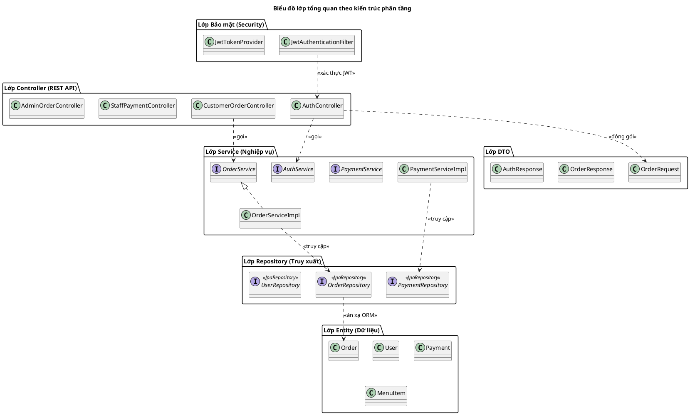
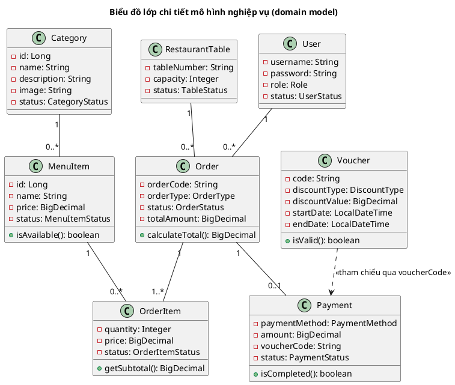
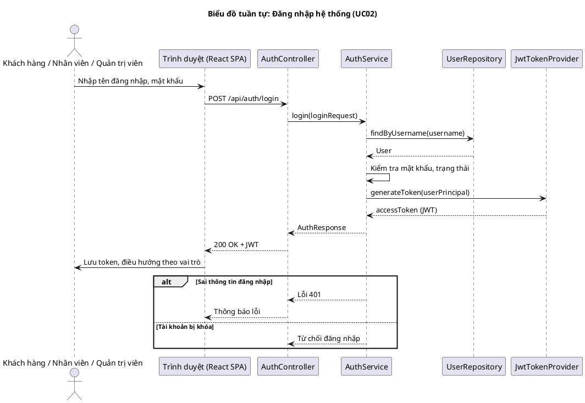
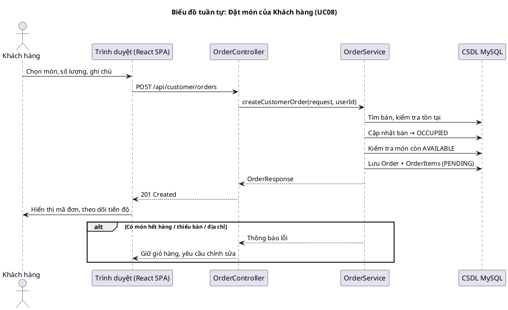
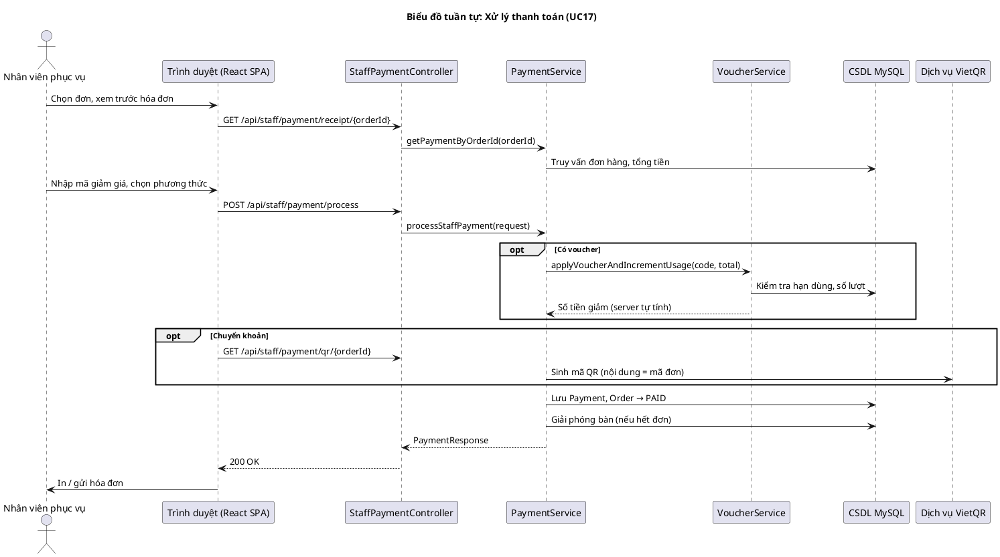
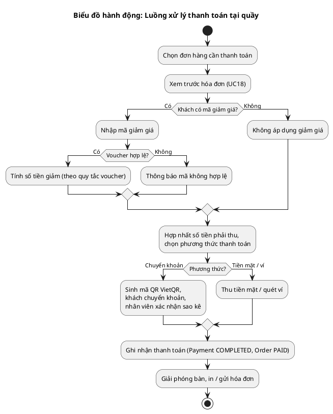
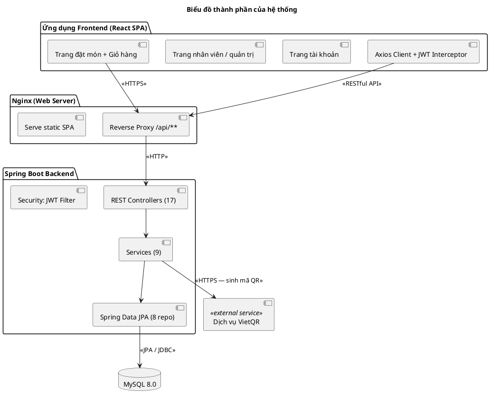
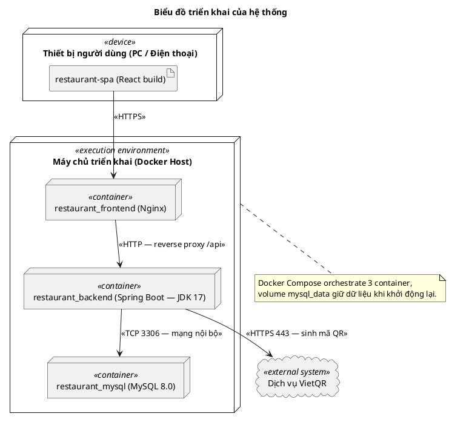

# 2.3. THIẾT KẾ HỆ THỐNG THEO MÔ HÌNH UML

Sau khi phân tích các chức năng của hệ thống ở mục 2.2, mục 2.3 tiến hành thiết kế chi tiết hệ thống bằng ngôn ngữ mô hình hóa thống nhất UML. Các biểu đồ được xây dựng bao gồm: biểu đồ lớp (class diagram), biểu đồ tuần tự (sequence diagram), biểu đồ hành động (activity diagram), biểu đồ thành phần (component diagram) và biểu đồ triển khai (deployment diagram). Việc thiết kế bám sát mã nguồn thực tế của dự án và áp dụng các mẫu thiết kế kinh điển trong lập trình Java (kiến trúc phân tầng, mẫu Service Layer, mẫu Repository, mẫu DTO, mẫu Dependency Injection...).

## 2.3.1. Biểu đồ lớp (Class diagram)

Biểu đồ lớp mô tả cấu trúc tĩnh của hệ thống: các lớp, thuộc tính, phép toán và mối quan hệ giữa chúng. Hệ thống được thiết kế theo kiến trúc phân tầng, mỗi tầng đảm nhận một vai trò riêng.

**Hình 2.5 – Biểu đồ lớp tổng quan theo kiến trúc phân tầng**


**Mô tả Hình 2.5:** Hệ thống được tổ chức thành các tầng chức năng:

- **Lớp Controller (tầng trình diễn):** 17 lớp REST Controller tiếp nhận yêu cầu HTTP từ giao diện (AuthController, CustomerOrderController, StaffPaymentController, AdminOrderController...), đóng gói dữ liệu truyền tải bằng các lớp **DTO** (OrderRequest, OrderResponse, AuthResponse, BankQrResponse...).
- **Lớp Service (tầng nghiệp vụ):** 9 cặp interface/implementation (OrderService/OrderServiceImpl, PaymentService/PaymentServiceImpl, AuthService...), chứa toàn bộ quy tắc nghiệp vụ: đặt món, thanh toán, kiểm tra voucher, thống kê.
- **Lớp Repository (tầng truy xuất dữ liệu):** 8 interface kế thừa `JpaRepository` của Spring Data JPA (OrderRepository, PaymentRepository, UserRepository...), chịu trách nhiệm truy cập cơ sở dữ liệu.
- **Lớp Entity (tầng mô hình dữ liệu):** 8 lớp thực thể được ánh xạ 1-1 với 8 bảng trong MySQL thông qua ORM (Hibernate).
- **Lớp Bảo mật (Security):** JwtAuthenticationFilter, JwtTokenProvider, UserPrincipal... thực hiện xác thực và phân quyền theo mô hình không lưu trạng thái (Stateless).
- **Lớp Cấu hình (Config):** SecurityConfig, DataInitializer (nạp dữ liệu mẫu), các tệp cấu hình và Docker.

**Hình 2.6 – Biểu đồ lớp chi tiết mô hình nghiệp vụ (domain model)**


**Mô tả Hình 2.6:** Tám lớp thực thể của mô hình nghiệp vụ với các mối quan hệ:

- `Category` (danh mục) chứa nhiều `MenuItem` (món ăn) — quan hệ 1 đến 0..*.
- `MenuItem` được sử dụng trong nhiều `OrderItem` (chi tiết món trong đơn) — quan hệ 1 đến 0..*.
- `Order` (đơn hàng) chứa một hoặc nhiều `OrderItem` — quan hệ 1 đến 1..*.
- `User` (khách hàng) đặt nhiều `Order` — quan hệ 1 đến 0..*; `RestaurantTable` (bàn ăn) gắn với nhiều `Order` — quan hệ 1 đến 0..*.
- `Order` có tối đa một `Payment` (thanh toán) — quan hệ 1 đến 0..1.
- `Voucher` được `Payment` tham chiếu gián tiếp qua thuộc tính `voucherCode` (khóa ngoại mềm), tránh phụ thuộc cứng giữa bảng thanh toán và bảng khuyến mãi.
- Các kiểu dữ liệu liệt kê (enumeration) gồm: `OrderStatus`, `OrderType`, `OrderItemStatus`, `PaymentMethod`, `PaymentStatus`, `TableStatus`, `Role`, `UserStatus`, `CategoryStatus`, `MenuItemStatus`, `DiscountType`.

**Bảng 2.31 – Danh sách các lớp thực thể chính và bảng dữ liệu tương ứng**

| Lớp thực thể | Bảng trong MySQL | Mô tả |
|---|---|---|
| User | user | Tài khoản người dùng: tên đăng nhập, mật khẩu (đã băm), họ tên, email, số điện thoại, địa chỉ, vai trò, trạng thái. |
| RestaurantTable | restaurant_table | Bàn ăn: số bàn, sức chứa, trạng thái, mã QR. |
| Category | category | Danh mục món ăn: tên, mô tả, hình ảnh, trạng thái. |
| MenuItem | menu_item | Món ăn: tên, mô tả, giá, hình ảnh, trạng thái còn/hết món, thuộc danh mục. |
| Order | order | Đơn hàng: mã đơn, hình thức đặt, trạng thái, tổng tiền, địa chỉ giao, số điện thoại, ghi chú. |
| OrderItem | order_item | Chi tiết món trong đơn: số lượng, đơn giá tại thời điểm đặt, ghi chú, trạng thái chế biến. |
| Payment | payment | Thanh toán: phương thức, số tiền, mã voucher, tiền giảm, trạng thái, thời điểm thanh toán. |
| Voucher | voucher | Mã giảm giá: loại giảm, giá trị, mức giảm tối đa, mức đơn tối thiểu, thời hạn, số lượt dùng, trạng thái. |

## 2.3.2. Biểu đồ tuần tự (Sequence diagram)

Biểu đồ tuần tự mô tả thứ tự trao đổi thông điệp giữa các đối tượng theo thời gian để thực hiện một chức năng. Ba biểu đồ tuần tự quan trọng nhất của hệ thống được mô tả dưới đây.

### 2.3.2.1. Biểu đồ tuần tự: Đăng nhập hệ thống

**Hình 2.7 – Biểu đồ tuần tự: Đăng nhập hệ thống (UC02)**


**Mô tả Hình 2.7:** Người dùng nhập tên đăng nhập và mật khẩu trên giao diện React; trình duyệt gửi yêu cầu `POST /api/auth/login` đến AuthController. AuthController ủy quyền cho AuthService kiểm tra thông tin qua UserRepository (tìm tài khoản theo tên đăng nhập), đối chiếu mật khẩu bằng PasswordEncoder, kiểm tra trạng thái tài khoản rồi sinh mã thông báo JWT qua JwtTokenProvider. Phản hồi AuthResponse (gồm JWT và thông tin tài khoản) được trả về trình duyệt; hệ thống tự động điều hướng theo vai trò. Luồng thay thế: nếu sai thông tin đăng nhập, hệ thống trả lỗi 401; nếu tài khoản bị khóa (INACTIVE), hệ thống từ chối đăng nhập.

### 2.3.2.2. Biểu đồ tuần tự: Đặt món của Khách hàng

**Hình 2.8 – Biểu đồ tuần tự: Đặt món của Khách hàng (UC08)**


**Mô tả Hình 2.8:** Khách hàng chọn món vào giỏ hàng trên giao diện React, sau đó gửi đơn bằng `POST /api/customer/orders`. OrderController gọi OrderService.createCustomerOrder để xử lý: kiểm tra bàn ăn (đối với đơn ăn tại bàn, tự chuyển bàn sang trạng thái *Có khách*), kiểm tra từng món còn ở trạng thái *Còn món*, sinh mã đơn hàng duy nhất (dạng `ORD-...`), lưu Order và các OrderItem ở trạng thái *Chờ xử lý* rồi tính tổng tiền. Phản hồi OrderResponse chứa mã đơn hàng được hiển thị để khách theo dõi tiến độ. Luồng thay thế: nếu có món hết hàng hoặc thiếu bàn/địa chỉ, hệ thống báo lỗi và giữ nguyên giỏ hàng cho khách chỉnh sửa.

### 2.3.2.3. Biểu đồ tuần tự: Xử lý thanh toán

**Hình 2.9 – Biểu đồ tuần tự: Xử lý thanh toán (UC17)**


**Mô tả Hình 2.9:** Nhân viên chọn đơn cần thanh toán, xem trước hóa đơn (UC18) rồi gửi `POST /api/staff/payment/process` kèm phương thức thanh toán và mã giảm giá (nếu có). PaymentService xử lý: khi có mã voucher, gọi VoucherService kiểm tra hạn dùng, số lượt và điều kiện áp dụng để tính số tiền giảm *phía máy chủ* (không tin số tiền do máy khách gửi lên, chống gian lận); nếu khách chọn chuyển khoản, hệ thống sinh mã QR theo chuẩn VietQR với nội dung chuyển khoản chính là mã đơn hàng để đối soát. Cuối cùng, hệ thống ghi nhận bản ghi Payment, chuyển đơn hàng sang trạng thái *Đã thanh toán*, giải phóng bàn ăn (đối với đơn ăn tại bàn) và trả về hóa đơn để in/gửi cho khách.

## 2.3.3. Biểu đồ hành động (Activity diagram)

Biểu đồ hành động mô tả luồng thực hiện công việc của hệ thống, bao gồm các nhánh quyết định, hợp nhất và lặp.

### 2.3.3.1. Biểu đồ hành động: Luồng đặt món của Khách hàng

**Hình 2.10 – Biểu đồ hành động: Luồng đặt món của Khách hàng**


**Mô tả Hình 2.10:** Luồng bắt đầu từ việc khách xem thực đơn, thêm món vào giỏ hàng và kiểm tra lại đơn. Tại nhánh quyết định *Hình thức đặt món*, luồng chia thành ba hướng: **Ăn tại bàn** (xác định bàn bằng sơ đồ bàn hoặc mã QR, kiểm tra bàn hợp lệ — nếu không sẽ yêu cầu chọn lại), **Mang về** (nhập số điện thoại liên hệ) và **Giao tận nơi** (nhập địa chỉ và số điện thoại). Ba nhánh hợp nhất tại bước kiểm tra *Món còn bán & thông tin hợp lệ*: nếu không hợp lệ, hệ thống báo lỗi và quay lại giỏ hàng; nếu hợp lệ, hệ thống sinh mã đơn hàng, tạo Order và OrderItems, cập nhật bàn sang *Có khách* (đơn tại bàn) và hiển thị mã đơn để theo dõi tiến độ.

### 2.3.3.2. Biểu đồ hành động: Luồng xử lý thanh toán tại quầy

**Hình 2.11 – Biểu đồ hành động: Luồng xử lý thanh toán tại quầy**


**Mô tả Hình 2.11:** Nhân viên chọn đơn cần thanh toán và xem trước hóa đơn. Nếu khách có mã giảm giá, hệ thống kiểm tra voucher: hợp lệ thì tính số tiền giảm theo quy tắc của voucher, không hợp lệ thì thông báo và tiếp tục không giảm. Sau khi hợp nhất số tiền phải thu, nhân viên chọn phương thức thanh toán — *Chuyển khoản* (sinh mã QR VietQR, khách chuyển khoản, nhân viên xác nhận trên sao kê) hoặc *Tiền mặt/ví* (thu tiền trực tiếp). Cuối cùng, hệ thống ghi nhận thanh toán (Payment *Completed*, Order *Paid*), giải phóng bàn nếu còn đơn khác đã hoàn tất và in/gửi hóa đơn cho khách.

## 2.3.4. Biểu đồ thành phần (Component diagram)

**Hình 2.12 – Biểu đồ thành phần của hệ thống**


**Mô tả Hình 2.12:** Hệ thống gồm năm thành phần chính:

- **Ứng dụng Frontend (React SPA):** các trang đặt món, tài khoản, vận hành (nhân viên), quản trị; Axios Client kèm JWT Interceptor tự động đính kèm mã thông báo vào mọi yêu cầu API.
- **Nginx (Web Server):** làm ngược (reverse proxy) chuyển yêu cầu `/api/**` về backend, đồng thời phục vụ các tệp tĩnh của SPA.
- **Spring Boot Backend:** khối nghiệp vụ trung tâm gồm REST Controllers, Services, Spring Data JPA, Security (JWT Filter) và Config.
- **MySQL 8.0:** cơ sở dữ liệu quan hệ lưu trữ 8 bảng dữ liệu của hệ thống.
- **Dịch vụ VietQR (bên ngoài):** dịch vụ sinh mã QR chuyển khoản theo chuẩn VietQR.

Các mối quan hệ: Frontend gọi RESTful API (JSON) thông qua Nginx; Backend truy cập MySQL bằng Spring Data JPA (JDBC); Backend kết nối HTTPS đến dịch vụ VietQR khi cần sinh mã QR thanh toán.

## 2.3.5. Biểu đồ triển khai (Deployment diagram)

**Hình 2.13 – Biểu đồ triển khai của hệ thống**


**Mô tả Hình 2.13:** Hệ thống được triển khai theo mô hình container hóa với Docker Compose:

- **Thiết bị người dùng (PC / Điện thoại):** sử dụng trình duyệt web truy cập ứng dụng React đã được build thành các tệp tĩnh.
- **Máy chủ triển khai (Docker Host):** chạy đồng thời ba container — `restaurant_frontend` (Nginx Alpine, cổng 80, chứa mã SPA tĩnh và cấu hình reverse proxy), `restaurant_backend` (Spring Boot đóng gói JAR trên nền JDK 17, cổng 8081) và `restaurant_mysql` (MySQL 8.0, cổng 3306 nội bộ, dữ liệu được giữ lại qua volume `mysql_data`).
- **Dịch vụ VietQR (đám mây):** hệ thống bên ngoài, backend kết nối qua HTTPS để sinh mã QR chuyển khoản.

Các kênh truyền: người dùng truy cập qua **HTTPS** đến Nginx; Nginx chuyển tiếp yêu cầu API đến backend qua **HTTP** (reverse proxy); backend truy cập MySQL qua **TCP 3306** trong mạng nội bộ của Docker; backend kết nối **HTTPS 443** đến dịch vụ VietQR.

**Bảng 2.32 – Cấu hình triển khai các container**

| Container | Công nghệ | Cổng | Vai trò |
|---|---|---|---|
| restaurant_frontend | Nginx Alpine | 80 | Phục vụ SPA tĩnh, reverse proxy `/api/**` về backend. |
| restaurant_backend | Spring Boot 3.3.x (JDK 17) | 8081 | Chạy toàn bộ nghiệp vụ REST API, bảo mật JWT. |
| restaurant_mysql | MySQL 8.0 | 3306 (nội bộ) | Lưu trữ dữ liệu; volume `mysql_data` giữ dữ liệu khi khởi động lại. |

## 2.3.6. Các mẫu thiết kế (design patterns) áp dụng

**Bảng 2.33 – Các mẫu thiết kế áp dụng trong hệ thống**

| Mẫu thiết kế | Vị trí áp dụng | Lợi ích |
|---|---|---|
| Kiến trúc phân tầng (Layered Architecture) | Toàn hệ thống: Controller – Service – Repository – Entity | Tách bạch trách nhiệm, dễ bảo trì và mở rộng. |
| Mẫu MVC / Front Controller | Spring DispatcherServlet + các REST Controller | Tập trung tiếp nhận và điều phối yêu cầu HTTP. |
| Mẫu Service Layer | 9 interface Service + implementation (OrderService, PaymentService...) | Đóng gói logic nghiệp vụ thành các dịch vụ dùng lại được. |
| Mẫu Repository | 8 interface kế thừa JpaRepository | Truy cập dữ liệu thống nhất, dễ chuyển đổi hệ quản trị cơ sở dữ liệu. |
| Mẫu DTO | Các lớp Request/Response (OrderRequest, AuthResponse...) | Cách ly dữ liệu truyền tải với mô hình thực thể, bảo mật dữ liệu nội bộ. |
| Mẫu Dependency Injection / IoC | Toàn bộ Spring Beans (constructor injection qua Lombok `@RequiredArgsConstructor`) | Giảm phụ thuộc cứng, dễ kiểm thử từng thành phần. |
| Mẫu Proxy | JwtAuthenticationFilter (bộ lọc tiền xử lý) | Chặn và kiểm tra JWT trước khi yêu cầu đến Controller. |
| Mẫu Singleton | Các Spring Service/Repository mặc định là singleton trong container | Tiết kiệm tài nguyên, quản lý tập trung. |
| Mẫu Observer (gián tiếp) | Cơ chế tự động đồng bộ trạng thái đơn/món phía khách hàng (polling) | Cập nhật tiến độ đơn theo thời gian thực cho khách. |

---

## Phụ lục B – Mã nguồn PlantUML của các biểu đồ UML mục 2.3

**Biểu đồ lớp tổng quan (Hình 2.5)**



**Biểu đồ lớp chi tiết mô hình nghiệp vụ (Hình 2.6)**



**Biểu đồ tuần tự: Đăng nhập (Hình 2.7)**



**Biểu đồ tuần tự: Đặt món (Hình 2.8)**



**Biểu đồ tuần tự: Xử lý thanh toán (Hình 2.9)**



**Biểu đồ hành động: Luồng đặt món (Hình 2.10)**

```plantuml
@startuml
title Biểu đồ hành động: Luồng đặt món của Khách hàng
start
:Xem thực đơn (tìm kiếm, lọc danh mục);
:Thêm món vào giỏ hàng;
:Mở giỏ hàng, kiểm tra lại đơn;
:Chọn hình thức đặt món;
if (Hình thức đặt món?) then (Ăn tại bàn)
  :Xác định bàn ăn (sơ đồ bàn / QR);
  if (Bàn hợp lệ?) then (Có)
  else (Không)
    :Thông báo lỗi, chọn lại bàn;
  endif
else (Mang về)
  :Nhập số điện thoại liên hệ;
else (Giao tận nơi)
  :Nhập địa chỉ + số điện thoại;
endif
if (Mòn còn bán &\nthông tin hợp lệ?) then (Không)
  :Thông báo lỗi, cập nhật giỏ hàng;
  stop
else (Có)
  :Sinh mã đơn (ORD-...),\ntạo Order + OrderItems (PENDING);
  :Cập nhật bàn → OCCUPIED,\nghi nhận tài khoản (nếu có);
  :Hiển thị mã đơn, theo dõi tiến độ;
endif
stop
@enduml
```

**Biểu đồ hành động: Luồng xử lý thanh toán (Hình 2.11)**



**Biểu đồ thành phần (Hình 2.12)**



**Biểu đồ triển khai (Hình 2.13)**


